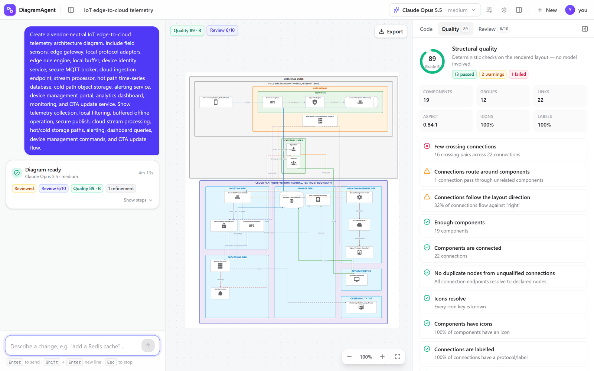

# DiagramAgent

Describe a system in plain language and get a clean, editable architecture diagram — planned, drawn, rendered, reviewed and refined by the **GitHub Copilot models your account already has** (Claude Opus 5.5 at medium reasoning by default). No API keys.



## Highlights

- **Sign in with your GitHub/Copilot identity** — uses the account signed in on your machine (`gh auth login` / `copilot login`), or an in-app *Sign in with GitHub* device-code flow. Organizations that federate GitHub with **Microsoft Entra ID** sign in through Entra as part of GitHub's normal sign-in.
- **Pick any model you're entitled to** — the model picker lists your Copilot catalog (Claude, GPT, Grok and more — whatever your plan includes) with vision/reasoning badges and a reasoning-effort control. Default: `claude-opus-5.5` @ `medium`.
- **A real pipeline, not a single prompt** — optional clarifying questions → architecture plan → D2 generation (streamed live) → render → deterministic quality checks → vision review → targeted refinement. Every refinement is re-checked and the best version wins.
- **Quality you can see** — a *Quality* tab scores every render (0–100) with 15 deterministic checks (phantom nodes, unknown icons, overlaps, crossings, aspect ratio, orphans, label coverage, …); a *Review* tab shows the vision model's score, findings and fixes per round.
- **Edit however you like** — chat ("add a Redis cache"), edit the D2 in a syntax-highlighted editor, or click elements on the canvas to relabel, delete, connect, or drag them into another container.
- **Export** — SVG, high-resolution PNG (icons and fonts embedded), editable draw.io, native Visio `.vsdx`, or raw `.d2`.
- **Polished UX** — resizable panels, light/dark/system themes, live progress with timings, stop at any time (<kbd>Esc</kbd>), keyboard shortcuts, and state that survives reloads.

## Quick start

Prerequisites: Node.js **20.19+ or 22.12+**, and a GitHub account with GitHub Copilot.

```bash
# 1. Sign in once on this machine (either works; Entra SSO happens in the browser if your org uses it)
gh auth login --web        # or: copilot login

# 2. Install and run
npm install
npm run dev
```

Open http://localhost:3000, pick an example (or describe your own system), and watch it build.

No `.env` file is needed for local use. See [`.env.example`](.env.example) for everything you *can* configure.

## Signing in and model access

DiagramAgent talks to models through the [GitHub Copilot SDK](https://github.com/github/copilot-sdk). Copilot entitlements belong to a GitHub identity, so there are two ways a request can run:

| Mode | When | How it works |
|------|------|--------------|
| **This machine's login** | Default for `npm run dev` | The server uses the GitHub account signed in via `gh auth login` or `copilot login`. The account menu shows *Signed in on this machine*. |
| **In-app GitHub sign-in** | When `GITHUB_OAUTH_CLIENT_ID` is set | *Sign in with GitHub* shows a device code; approve it on github.com (Entra ID SSO/EMU users are routed through Entra automatically). The token is kept server-side in an AES-256-GCM-encrypted, `HttpOnly`, `SameSite=Lax` cookie and is never exposed to browser JavaScript. |

Production builds **refuse** the machine login unless you opt in with `DIAGRAM_AGENT_ALLOW_MACHINE_LOGIN=true` — a hosted instance never lends its operator's Copilot seat to anonymous visitors.

To enable in-app sign-in, register a GitHub OAuth App (or GitHub App) with **Enable Device Flow** checked and set:

```env
GITHUB_OAUTH_CLIENT_ID=<your app's client id>        # public identifier, not a secret
DIAGRAM_AGENT_SESSION_SECRET=<32+ random characters>  # required in production
```

### Models

- The picker shows only the models the signed-in account can use (from Copilot's model list), grouped by provider, with the default pinned first.
- Reasoning effort (low → max) is offered for models that support it.
- **Generation settings** let you turn clarifying questions and vision review on/off, choose 0–3 refinement rounds, and pick a different (vision-capable) *reviewer* model for a second opinion.
- Change the default with `DIAGRAM_AGENT_DEFAULT_MODEL=copilot:<model>@<effort>`. If the default isn't in an account's catalog, the next best available model is chosen.
- Unknown model IDs are rejected server-side (the Copilot runtime would otherwise silently fall back to another model).

**Optional: Azure OpenAI.** Set `AZURE_AI_FOUNDRY_ENDPOINT` to also list your Azure OpenAI / AI Foundry deployments in the picker. Those calls authenticate with Microsoft Entra ID through `DefaultAzureCredential` (`az login`, managed identity, …) — no keys.

## How it works

```
prompt ──► clarify (optional) ──► plan ──► generate D2 (streamed) ──► render (D2 WASM, ELK)
                                                     ▲                      │
                                                     │             quality checks (deterministic)
                                                     │                      │
                                             refine with findings ◄── vision review (score /10)
                                                     │
                                          best candidate across rounds ──► canvas / editor / export
```

- **Plan** — an architecture blueprint (components, hierarchy, zones, connections, HA/DR mirroring) plus a deterministic D2 scaffold so the generator refines a complete skeleton instead of dropping components.
- **Quality checks** — computed from the compiled layout on every render, no model involved. Critical failures (e.g. duplicate nodes created by unqualified connection paths) are fixed before spending a vision review.
- **Vision review** — the reviewer model looks at a PNG of the diagram (icons and fonts embedded) and scores intent coverage, flow, grouping, routing and style. Pass = 7/10, computed server-side.
- **Refinement** — review findings plus failed checks are fed back; every refined candidate is rendered and reviewed again, and a regression guard keeps the best one.

Model calls run in isolated, tool-less Copilot sessions (`mode: "empty"`, replaced system prompt, no filesystem or shell access) with their state kept outside your `~/.copilot`.

## Quality and testing

```bash
npm test                  # unit, component, route and diagram-fixture tests (Vitest)
npm run lint
npx tsc --noEmit
npm run eval:diagrams     # live end-to-end eval against real Copilot models (see below)
```

- **Diagram fixtures** — `src/test/fixtures/diagrams/*.d2` are real outputs from the pipeline that passed review. `src/test/diagram-fixtures.test.ts` renders each with the real D2 engine (no network) and asserts quality score, no critical failures, keyword coverage, and that draw.io/Visio export works.
- **Live eval** — `npm run eval:diagrams` runs the full pipeline over [`evals/cases.json`](evals/cases.json) with your Copilot access and writes diagrams, PNGs, reviews and a summary to `eval-output/` (git-ignored). Options: `--cases a,b`, `--model copilot:<model>@<effort>`, `--reviewer …`, `--refinements N`, `--concurrency N`, `--no-review`, `--update-fixtures`.

### Latest eval (2026-09-28)

10 cases, `claude-opus-5.5` @ medium for every step (plan, generate, review), 1 refinement round:

| Case | Quality | Review | Aspect | Keywords | Time |
|------|--------:|-------:|-------:|---------:|-----:|
| aws-three-tier-web | 90 (A) | 6/10 | 4.03:1 | 8/8 | 4.0 min |
| aws-serverless-events | 89 (B) | 6/10 | 2.21:1 | 8/8 | 4.2 min |
| azure-sql-always-on-hadr | 88 (B) | 6/10 | 6.57:1 | 7/8 | 5.7 min |
| azure-hub-spoke-network | 82 (B) | 6/10 | 2.89:1 | 8/8 | 5.9 min |
| azure-rag-llm-app | 88 (B) | 6/10 | 3.87:1 | 8/8 | 4.5 min |
| kubernetes-microservices-mesh | 89 (B) | 6/10 | 2.50:1 | 8/8 | 4.7 min |
| github-actions-aks-cicd | 86 (B) | 6/10 | 4.44:1 | 8/8 | 4.8 min |
| streaming-kafka-spark-lakehouse | 86 (B) | 6/10 | 0.99:1 | 8/8 | 4.0 min |
| gcp-analytics-platform | 88 (B) | 6/10 | 5.44:1 | 8/8 | 4.6 min |
| iot-edge-cloud-telemetry | 89 (B) | 6/10 | 0.84:1 | 8/8 | 4.2 min |

Every case renders, covers at least 7 of 8 required components and scores 82–90 on the deterministic checks. The vision reviewer consistently rates them **6/10 — "usable but needs work"**: its recurring findings are wide layouts (5 of 10 are wider than 3.5:1), long edges looping across containers, and colliding labels in dense areas. No run reached the 7/10 pass mark, so the app reports *Reviewed* with the findings and an **Apply suggested fixes** action rather than *Passed review*. Better automatic layout for large systems is the main open quality item.

### Example output

Real pipeline output (golden fixtures), rendered by the app:

| IoT edge-to-cloud | Kubernetes microservices | RAG chat app on Azure |
|---|---|---|
|  |  |  |

| Vision review with suggested fixes | In-app GitHub sign-in |
|---|---|
|  |  |

## Configuration

| Variable | Default | Purpose |
|----------|---------|---------|
| `DIAGRAM_AGENT_DEFAULT_MODEL` | `copilot:claude-opus-5.5@medium` | Default model (`provider:model@effort`) |
| `GITHUB_OAUTH_CLIENT_ID` | — | Enables in-app *Sign in with GitHub* (device flow) |
| `DIAGRAM_AGENT_SESSION_SECRET` | per-process random key in dev | Encrypts the session cookie; required in production with in-app sign-in |
| `DIAGRAM_AGENT_ALLOW_MACHINE_LOGIN` | `true` in dev, `false` in production | Let requests use the server machine's GitHub login |
| `DIAGRAM_AGENT_COPILOT_HOME` | `<tmp>/diagram-agent/copilot` | Copilot runtime state directory |
| `AZURE_AI_FOUNDRY_ENDPOINT` | — | Optional Azure OpenAI / AI Foundry endpoint (Entra ID auth) |

## Security

- No keys or tokens in the repo; `.env*` is git-ignored and CI runs a full-history [gitleaks](https://github.com/gitleaks/gitleaks) scan on every push and PR.
- API routes accept JSON only, reject cross-site/cross-origin browser requests, and bound payload sizes — a random web page can't spend your Copilot quota through your browser.
- Rendered SVG is sanitised (DOMPurify) before it is inserted into the page, because labels, links and tooltips are model-generated.
- Errors returned to the browser never include upstream payloads or stack traces.

## Project structure

```
src/
├── app/
│   ├── page.tsx                 # Workspace: top bar, conversation, canvas, inspector
│   └── api/                     # auth/*, models, clarify, plan, generate (SSE), assess, render, export/*
├── components/                  # UI (ModelPicker, ConversationPanel, RunCard, DiagramCanvas, Inspector, …)
├── hooks/                       # useDiagramAgent (conversation + pipeline), useCopilot, useLiveRender, useTheme
└── lib/
    ├── llm/                     # Copilot SDK provider, optional Azure provider, model selection
    ├── auth/                    # device flow, sealed session cookie, machine-login policy
    ├── pipeline/                # prompts, server steps, pure refine loop shared by UI and evals
    ├── quality/                 # deterministic diagram scoring
    ├── d2-render.ts             # D2 WASM rendering
    └── svg-raster.ts            # SVG → PNG with embedded icons and fonts
evals/                           # live eval cases
scripts/eval-diagrams.ts         # eval harness
```

## License

MIT — see [LICENSE](LICENSE). Bundled icons are third-party assets; see [THIRD_PARTY_NOTICES.md](THIRD_PARTY_NOTICES.md).
