# DiagramAgent

Describe a system in plain language and get a polished, editable architecture diagram in the conventions of the reference architectures you already know: the Azure Architecture Center, AWS and Google Cloud reference diagrams, Kubernetes docs and Eraser-style cloud diagrams. You get nested cloud, region, network and subnet boundaries, real service icons, labelled connections and numbered workflows. Diagrams are planned, drawn, reviewed and refined by the **GitHub Copilot models your account already has** (Claude Opus 5.5 at medium reasoning by default). No API keys.

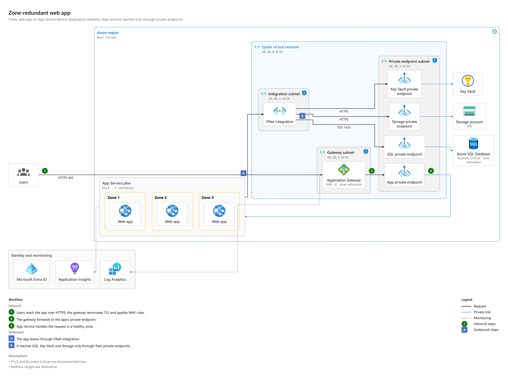

## Highlights

- **Reference architecture, not a template.** The model writes a topology spec: components, nested boundaries, connections with a meaning (request, async, replication, private link, peering, VPN, monitoring, management, egress), up to two numbered workflows, and assumptions. A deterministic engine lays it out: ELK's compound layout plus designer polish.
  - Private endpoints line up with their services, and parallel zones follow author order.
  - Lines are straightened, and connectors are routed around components and boundary titles.
  - Each platform draws in its own conventions: Azure VNets and subnets, AWS VPCs with tinted subnets, Google Cloud projects, Kubernetes clusters and namespaces. In a mixed-cloud diagram, each boundary keeps its own style.

  The [architecture guide](docs/architecture-guide.md) and [JSON Schema](docs/architecture.schema.json) make the language usable by other agents too.
- **Facts you can trust.** The model is told never to present an address range, SKU, count or port the request didn't give as a fact of your system, and to list the defaults it proposes for a new design as assumptions. When it slips one in anyway, the app lists it on the diagram under *Proposed, not in the request*.
- **Auto picks the style.** Four styles are available:
  - *Architecture* for systems, networks and deployments.
  - *Poster* for overviews, journeys and processes: a designed one-page layout with columns, lanes and cards.
  - *Graph* when you choose it: a free-form diagram laid out by D2.
  - *Auto*, the default, routes each request to Architecture or Poster.

  Each run shows the style it used, and *Redo as …* draws it again in the other.
- **Sign in with your GitHub/Copilot identity** — uses the account signed in on your machine (`gh auth login` / `copilot login`), or an in-app *Sign in with GitHub* device-code flow. Organizations that federate GitHub with **Microsoft Entra ID** sign in through Entra as part of GitHub's normal sign-in.
- **Pick any model you're entitled to** — the model picker lists your Copilot catalog (Claude, GPT, Grok and more — whatever your plan includes) with vision/reasoning badges and a reasoning-effort control. Default: `claude-opus-5.5` @ `medium`.
- **A real pipeline, not a single prompt** — optional clarifying questions → a spec (streamed live, so the diagram builds up as it arrives) → layout → deterministic quality checks → vision review → targeted refinement. Every refinement is re-checked, and the best version wins.
- **Quality you can see** — a *Quality* tab scores every render (0–100) with deterministic checks (text fit, overlaps, connectors through cards, aspect ratio, crossings, density, balance, …); a *Review* tab shows the vision model's score, findings and fixes per round.
- **Edit by hand or by chat** — drag, rename, add, connect and delete on the canvas, with full undo and redo. Edit a component's detail, a boundary's facts, a connector's meaning or the title in place. Ask in chat ("add a Redis cache") and the AI edits the spec. *Tidy up* re-lays out the diagram and keeps your edits.
- **Export what you see** — SVG, high-resolution PNG (icons and fonts embedded), editable draw.io, native Visio `.vsdx` and Excalidraw, plus the spec, D2 and Mermaid source.
- **Graph style when you want it** — choose *Graph* in settings for free-form diagrams laid out by D2, and imported D2 opens as a graph too. *Convert to Architecture* turns a graph into an Architecture diagram, with a preview of what carries over and what doesn't.
- **Polished UX** — resizable panels, light/dark/system themes, live progress with timings, stop at any time (<kbd>Esc</kbd>), keyboard shortcuts, and state that survives reloads.

## Quick start

Prerequisites: Node.js **20.19+ or 22.12+**, and a GitHub account with GitHub Copilot.

```bash
# 1. Sign in once on this machine (either works; Entra SSO happens in the browser if your org uses it)
gh auth login --web        # or: copilot login

# 2. Install and run
npm install
npm run dev
```

Open http://localhost:3000, pick an example (or describe your own system), and watch it build.

No `.env` file is needed for local use. See [`.env.example`](.env.example) for everything you *can* configure.

### Try the styles

Choose the style under **Generation settings** (the gear icon) → **Diagram style**: *Auto* (the default), *Architecture*, *Poster* or *Graph*. Then paste a prompt. Some to start with:

| Style | Prompt to try | Look for |
|---|---|---|
| Architecture | *Multi-region web application on Google Cloud … two regions side by side, each with the same three tiers drawn as boxes …* | the regions mirrored, with web, app and database tiers lined up |
| Architecture | *Create an AWS three-tier web application architecture diagram … across two Availability Zones …* | zones as a grid, one load balancer |
| Poster | *Customer onboarding journey for a digital bank, from sign-up to first payment …* | lanes, lettered flows, a timing on each card |
| Graph | *State machine for an online order: created, paid, packed, shipped and delivered …* | D2's automatic layout |

The full prompts are in [docs/sample-prompts.md](docs/sample-prompts.md): 14 across the styles, with what to look for in each, follow-up edits, and how to open the exact specs behind the images in this README.

## Signing in and model access

DiagramAgent talks to models through the [GitHub Copilot SDK](https://github.com/github/copilot-sdk). Copilot entitlements belong to a GitHub identity, so there are two ways a request can run:

| Mode | When | How it works |
|------|------|--------------|
| **This machine's login** | Default for `npm run dev` | The server uses the GitHub account signed in via `gh auth login` or `copilot login`. The account menu shows *Signed in on this machine*. |
| **In-app GitHub sign-in** | When `GITHUB_OAUTH_CLIENT_ID` is set | *Sign in with GitHub* shows a device code; approve it on github.com (Entra ID SSO/EMU users are routed through Entra automatically). The token is sealed with AES-256-GCM into an `HttpOnly`, `SameSite=Lax` cookie that expires after 8 hours: it lives in your browser, page scripts can't read it, and it's useless without the server's secret. Signing out clears the cookie but doesn't revoke the app on GitHub; do that under *Settings → Applications*. |

Production builds **refuse** the machine login unless you opt in with `DIAGRAM_AGENT_ALLOW_MACHINE_LOGIN=true` — a hosted instance never lends its operator's Copilot seat to anonymous visitors. Even when it's allowed, the machine login only serves requests addressed to `localhost`, `127.0.0.1` or `[::1]` (add trusted names with `DIAGRAM_AGENT_ALLOWED_HOSTS`), so the app opened through a LAN address or a rebinding DNS name can't borrow your GitHub session. `npm run dev` listens on `127.0.0.1` only for the same reason; `npm run dev -- -H 0.0.0.0` opens it up, and other devices then need the in-app sign-in.

To enable in-app sign-in, register a GitHub OAuth App (or GitHub App) with **Enable Device Flow** checked and set:

```env
GITHUB_OAUTH_CLIENT_ID=<your app's client id>        # public identifier, not a secret
DIAGRAM_AGENT_SESSION_SECRET=<32+ random characters>  # required in production
```

### Models

- The picker shows only the models the signed-in account can use (from Copilot's model list), grouped by provider, with the default pinned first.
- Reasoning effort (low → max) is offered for models that support it.
- **Generation settings** let you turn clarifying questions and vision review on/off, choose 0–3 refinement rounds, and pick a different (vision-capable) *reviewer* model for a second opinion.
- Change the default with `DIAGRAM_AGENT_DEFAULT_MODEL=copilot:<model>@<effort>`. If the default isn't in an account's catalog, the next best available model is chosen.
- Unknown model IDs are rejected server-side (the Copilot runtime would otherwise silently fall back to another model).

**Optional: Azure OpenAI.** Set `AZURE_AI_FOUNDRY_ENDPOINT` to also list your Azure OpenAI / AI Foundry deployments in the picker. Those calls authenticate with Microsoft Entra ID through `DefaultAzureCredential` (`az login`, managed identity, …) — no keys. Because that is the *server's* Azure identity, Azure models are offered only to the machine login and to GitHub users listed in `DIAGRAM_AGENT_AZURE_USERS` (`*` = everyone signed in).

## How it works

```
prompt ──► clarify (optional) ──► style: Auto routes to Architecture or Poster (or Graph by choice)
                                         │
                                         ▼
                          spec (streamed) ──► layout engine ──► diagram model
                                ▲                                     │
                                │               quality checks + platform renderer
                                │                                     │
                        refine the spec ◄──────────── vision review (score /10)
                                │
                     best candidate ──► canvas (hand edits, undo) ──► exports
```

- **Clarify and route** — the optional clarifying step analyses the request. It picks the style and the view (deployment, network, application, dataflow or context) and tells an existing system from a new design. For an existing system it asks about essential unknown facts; for a new design it proposes defaults as assumptions. Without clarification, a heuristic routes by the request's wording (negation-aware).
- **Architecture spec** — the model describes structure and intent, never coordinates:
  - `items`: components (name, icon, one detail line) and nested boundaries (`cloud`, `subscription`, `region`, `vnet`, `subnet`, `zone`, `cluster`, `namespace`, `shared`, `onprem` and more), each with optional facts
  - `connections` with a `meaning`, a label and an optional step
  - up to two `sequences` (numbered, then lettered), `overlays` for groups that span boundaries (an Auto Scaling group across zones), and `assumptions`

  Parsing is lenient: aliases, name references, flat `parent` fields, unknown icons and common misspellings are repaired and reported, and irreparable input is rejected without touching the canvas. Every candidate then gets the same grounding check the eval uses: a concrete fact that neither your requests nor an assumption states is listed under *Proposed, not in the request*. See the [architecture guide](docs/architecture-guide.md).
- **Architecture engine** (`src/lib/arch`) — ELK's layered compound layout proposes several candidates: whole-graph ones, and a hybrid that arranges top-level blocks. Designer polish passes then run:
  - pack connector-free groups in author order
  - draw parallel zones or regions that hold the same tiers as a grid, each tier lined up across them, as AWS and Azure reference diagrams do
  - put shared services in a bottom band, and keep parallel lanes in author order
  - straighten near-straight lines
  - route the remaining connectors with an obstacle-avoiding router that steers clear of other routes and of boundary titles
  - place labels and step badges where they collide with nothing

  A score (hard constraints first, then page aspect, crossings, loops and bends) picks the winner, and the same spec always gives the same diagram. Envelope-size diagrams (60 components, 80 connections, 5 levels of nesting) lay out in about two seconds; see the [layout spike and performance gate](docs/spikes/2026-09-29-architecture-layout-spike.md).
- **Platform renderer** — style packs carry each platform's conventions:
  - Azure: dashed VNets with their icon, grey subnets with a shield, yellow zones, green and blue step badges
  - AWS: unfilled groups, tinted public and private subnets, open arrowheads, black badges
  - Google Cloud, Kubernetes and a neutral pack
- **Quality checks** — computed on every render with no model involved: text fit, overlaps, connectors through components or titles, label collisions, nesting, aspect ratio, crossings, bend chains, icon coverage, labelled primary flow and repaired input.
- **Vision review** — the reviewer model looks at a PNG of the diagram (icons and fonts embedded) and scores it against the request and the platform's conventions. Pass = 7/10, computed server-side.
- **Refinement** — review findings and failed checks go back to the model as spec edits; every refined candidate is rendered and reviewed again, and a regression guard keeps the best one.
- **Diagram model** — every style lands on the same editable model: one renderer draws it for the canvas, the exports and the reviewer, so they always match. The spec is derived back from the model, so hand edits carry into the next AI edit and into *Tidy up*. These include renames, details, facts, meanings, icons and moving a component into another boundary.
- **Poster and Graph** — *Poster* uses the composition engine (`src/lib/compose`): columns, lanes and cards on a grid. *Graph* has the model write D2, laid out by D2's engine; chat edits merge into your arrangement by node id, and *Tidy up* re-runs D2's layout.
- **Code tab** — shows the spec, D2 and Mermaid generated from the model (read-only). *Import…* opens an Architecture or Poster spec or D2 from elsewhere, and diagrams saved by earlier versions are imported automatically.

### Architecture diagrams

- **Portable language:** the [architecture guide](docs/architecture-guide.md) and [JSON Schema](docs/architecture.schema.json) describe the spec for people and for other models or agents.
- **Render a spec from the command line:** `npm run compose -- src/test/fixtures/architecture/azure-hub-spoke.json -o hub.png`. The CLI detects Architecture or Poster specs (`--kind` overrides) and prints the page, the chosen layout, crossings and the quality report. Use `npm run -s compose -- ... --json` for machine-readable JSON without npm's banner; `--strict` works as for posters.
- **Exports by tier:** draw.io, Visio and Excalidraw carry icons, styled boundaries, step badges, overlays and the page blocks. D2 and Mermaid carry the topology, grouping, labels and step marks, and say what they drop.
### Poster diagrams

- **Portable language:** the [composition guide](docs/composition-guide.md) and [JSON Schema](docs/composition.schema.json) describe the spec for people and for other models or agents.
- **Render a spec from the command line:** `npm run compose -- src/test/fixtures/compositions/knowledge-assistant.json -o knowledge-assistant.svg` (or `.png`). It prints the page size, any repairs and the quality score. For agents, `npm run -s compose -- ... --json` prints a machine-readable report without npm's banner and `--strict` exits with code 2 until the spec needs no repairs (see the [guide](docs/composition-guide.md#rendering-it)).
- **Hand edits on the canvas:** select an item to edit its title, details and colour. Drag items between columns; *Tidy up* snaps them into the grid.

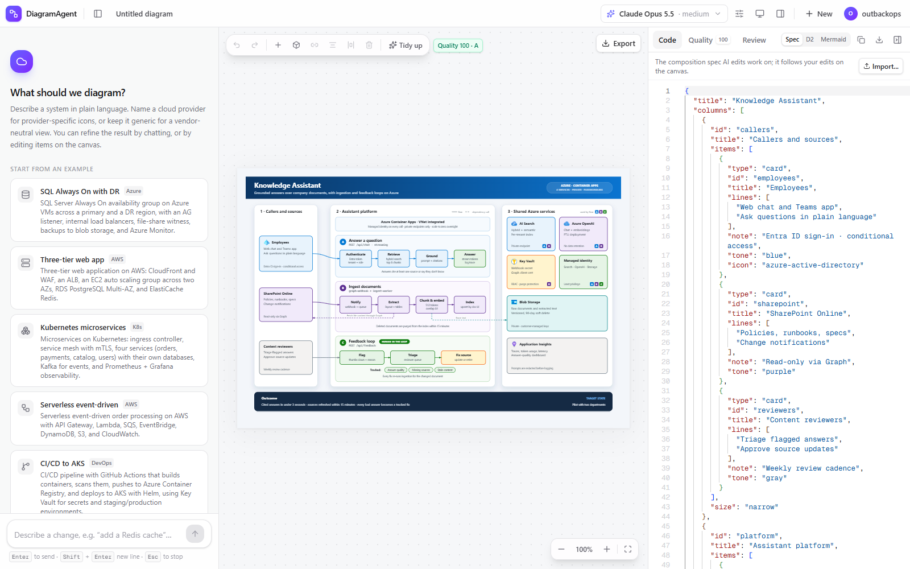

Model calls run in isolated, tool-less Copilot sessions (`mode: "empty"`, replaced system prompt, no filesystem or shell access) with their state kept outside your `~/.copilot`.

## Quality and testing

```bash
npm test                  # unit, component, route and diagram-fixture tests (Vitest)
npm run lint
npx tsc --noEmit
npm run eval:diagrams     # live end-to-end eval against real Copilot models (see below)
```

- **Architecture fixtures** — `src/test/fixtures/architecture/*.json` are original specs: a zone-redundant Azure web app, an Azure hub-and-spoke network, an AWS three-tier app across two Availability Zones, a Kubernetes shop and a multi-cloud hybrid, plus two stress cases (microservices with cycles, a label-dense lakehouse). The tests check that each one:
  - lays out within the hard constraints, with a page aspect between 1:1 and 2.3:1 and no connector looping around the page
  - keeps every component inside its boundary, and lines matching tiers up across zones (`src/lib/arch/layout.test.ts`)
  - round-trips through the spec derived from its model to the identical layout, and keeps every field through model validation (`src/lib/arch/from-model.test.ts`)
  - renders its platform's conventions deterministically (`src/lib/model/render-architecture.test.ts`)
- **Composition fixtures** — `src/test/fixtures/compositions/*.json` are original specs (a RAG assistant, a hub-and-spoke network, a fleet telemetry pipeline, a small web app) plus the composer prompt's two examples. `src/test/composition-fixtures.test.ts` checks that each one:
  - normalises without repairs and lays out without cutting text
  - scores 90 or more with no failed checks
  - keeps a presentable aspect ratio
  - renders byte-identically twice and passes model validation
  - round-trips through the spec derived from its model to the identical layout
- **Diagram fixtures** — `src/test/fixtures/diagrams/*.d2` are real pipeline outputs from the live eval below; each passed the deterministic quality gates (the vision reviewer rated them 6/10). `src/test/diagram-fixtures.test.ts` lays each out with the real D2 engine (no network), imports it into the model, and asserts quality score, no critical failures, that scoring the model matches scoring the compiled layout, keyword coverage (also in the D2 exported from the model), and that draw.io/Visio export works. `src/lib/model/d2-convert.test.ts` round-trips every fixture through D2 export and re-import with the same ids, groups, labels, styles and connections.
- **Live eval** — `npm run eval:diagrams` runs the full pipeline over [`evals/cases.json`](evals/cases.json) with your Copilot access and writes diagrams, PNGs, judgments, faithfulness reports and a summary to `eval-output/` (git-ignored). Options:
  - `--format architecture|composition|d2` (default `architecture`) and `--samples N` (the summary reports each case's mean and minimum; pass rates count samples)
  - `--judge copilot:<model>@<effort>`: an independent judge that sees only the request and the image. Use another model family than the generator. A sample the judge can't score is marked *unreviewed* and left out of the averages.
  - `--cases a,b`, and `--cases-file evals/held-out.json` for the held-out set (run it once, after tuning)
  - `--model …`, `--reviewer …` (the generator's own reviewer, which drives refinement and is reported as a diagnostic only), `--refinements N`, `--concurrency N`, `--no-review`
  - `--update-fixtures` (with `--format d2`; refreshes the D2 golden fixtures)

  Architecture samples also get a structural faithfulness check: required components, boundaries and flows are present, nothing prohibited appears, and every concrete fact (address range, port, SKU, count, version) comes from the request or is listed as an assumption. A faithfulness failure fails the sample whatever the judge says. `npx tsx scripts/eval-paired-d2.ts --judge …` runs the paired Graph-versus-Architecture comparison and applies the pre-registered rule in [`src/lib/eval/paired.ts`](src/lib/eval/paired.ts).

### Latest eval: Architecture diagrams (2026-09-30)

The run covered the 11 cases in [`evals/cases.json`](evals/cases.json), two samples each, with one refinement round. Claude Opus 5.5 and GPT-6 Sol (both at medium) generated the diagrams. Each generator was judged blind by the other family: the judge sees only the request and the PNG.

A sample passes when all of these hold:
- It renders and scores at least 75 on the deterministic checks, with no critical failure.
- It passes faithfulness: required components, boundaries and flows are present, nothing prohibited appears, and every concrete fact comes from the request or an assumption.
- The judge gives it 7 or more.

| Run | Opus 5.5: pass | judge mean | faithfulness failures | GPT-6 Sol: pass | judge mean | faithfulness failures |
|---|---:|---:|---:|---:|---:|---:|
| Baseline (first complete engine) | 5/22 (23%) | 6.50 | 4 | 5/22 (23%) | 6.00 | 3 |
| Tuning round 1 | 7/22 (32%) | 7.00 | 10 | 5/22 (23%) | 6.50 | 3 |
| Tuning round 2 | 8/22 (36%) | 6.91 | 7 | 6/22 (27%) | 6.32 | 1 |
| **Final** | **14/22 (64%)** | **7.27** | **4** | **8/22 (36%)** | **6.36** | **1** |
| Held-out: 6 new cases, run once | 4/12 (33%) | 7.17 | 5 | 4/12 (33%) | 6.55 | 5 |

GPT-6 Sol judges Opus's diagrams and Opus judges Sol's, and Opus is the stricter judge, so compare rows within a column. Every row is scored with the final faithfulness checker (`scripts/eval-rescore.ts` re-applies it to a saved run).

**What moved the numbers:**
- **Tier grids.** Zones and regions that hold the same subnets are drawn as a grid, the way AWS and Azure reference diagrams draw them: AWS three-tier, SQL Server across regions, hub-and-spoke.
- **One of each.** A load balancer that spans zones is drawn once, and an Auto Scaling group is an overlay rather than a component.
- **Disclosed facts.** No final or held-out sample failed on an undisclosed fact. Anything the model slipped in is listed under *Proposed, not in the request*: 5 of Opus's 22 final samples needed a line (an SSE-S3 setting, model names, an instance count), and none of Sol's did.
- **Earlier tuning rounds:**
  - larger text
  - labelled and stepped links are always drawn
  - connectors route around boundary titles
  - a lettered second workflow
  - DNS is drawn as a lookup rather than a traffic hop
  - labels fit on short links

**Where it falls short:**
- **Targets not met.** The plan's targets were a judge mean of 8 and a 90% pass rate. The best result is Opus at 64% and 7.27.
- **Held-out gap.** The held-out set (an existing hybrid network, multi-cloud DR, software with no cloud, unusual shared services, a three-tier stack described bottom-up, a terse hub-and-spoke) passes 33% for both generators. For Opus that's well below the tuned set, so part of the tuning gain doesn't generalise.
  - Every held-out faithfulness failure is a missing flow, not an invented fact.
  - Two per generator are expectations that contradict the conventions above. One case wants a "Route 53 → CloudFront" hop, where the prompt draws DNS as a lookup. Another wants an "on-premises → hub" link, where the models draw the request from the app through the firewall and the ExpressRoute circuit to the on-premises database.
- **Recurring judge findings:**
  - text reads small when the whole page is scaled to fit
  - long connectors into shared services
  - crowding around dense tiers
  - for AWS, the load balancer drawn beside the zones rather than spanning both public subnets, which is AWS's own convention and the next layout step
- **Checker limitation.** Opus's four remaining tuned-set faithfulness failures are missing flows:
  - In the RAG app (two samples), the model draws the reference-correct path through VNet integration and a private endpoint (App Service → private endpoint → AI Search), and the check wants a direct connection.
  - In the CI/CD case (two samples), Key Vault supplies secrets to the apps rather than to the deploy step.
- **Validity with a smaller model.** Claude Haiku 4.5 produced a usable spec on the first attempt for all 11 cases (a validity check only, not judged). Opus and Sol did too.

**Should Graph stay?** A pre-registered rule decides whether Graph leaves the style picker for new diagrams. Graph goes only if Architecture wins on every count:
- **(a) Layout** (`eval-paired-d2.ts --layout-only`, the 7 fixture topologies through both engines). Architecture meets the hard constraints on 7/7 and has the better page aspect on 5/7, but fewer crossings on only 1/7. It loses on the AWS three-tier (6 against 2), the lakehouse (26 against 24) and the multi-cloud hybrid (3 against 1).
- **(b) End to end.** The same 11 prompts were generated by Opus 5.5 with the style forced each way, then judged blind by GPT-6 Sol. Architecture wins 8 of 11 pairings (73%), with a mean judged score of 6.82 against 6.00 (+0.82), and has 2 faithfulness failures against Graph's 5. All three end-to-end criteria pass.

The rule fails only on crossings in (a), so **Graph stays** as a style you can choose. New diagrams default to Architecture or Poster through *Auto*, and end to end the judge prefers Architecture.

### Poster eval: composed diagrams (2026-09-29)

10 cases, composition format, 1 refinement round. Each model generated and reviewed its own diagrams:

| Case | Claude Opus 5.5: quality | review | GPT-6 Sol: quality | review |
|------|---------:|-------:|---------:|-------:|
| azure-sql-always-on-hadr | 89 (B) | 8/10 | 94 (A) | 8/10 |
| aws-three-tier-web | 100 (A) | 7/10 | 100 (A) | 8/10 |
| aws-serverless-events | 91 (A) | 7/10 | 93 (A) | 8/10 |
| kubernetes-microservices-mesh | 98 (A) | 7/10 | 94 (A) | 8/10 |
| github-actions-aks-cicd | 98 (A) | — ¹ | 96 (A) | 8/10 |
| streaming-kafka-spark-lakehouse | 98 (A) | 7/10 | 98 (A) | 9/10 |
| azure-hub-spoke-network | 98 (A) | 8/10 | 77 (C) | 7/10 |
| azure-rag-llm-app | 94 (A) | 7/10 | 79 (C) | 9/10 |
| gcp-analytics-platform | 98 (A) | 8/10 | 96 (A) | 8/10 |
| iot-edge-cloud-telemetry | 96 (A) | 7/10 | 84 (B) | 8/10 |

¹ The review call timed out (180 s); the diagram rendered and scored 98.

- **GPT-6 Sol:** 10 of 10 pass review, averaging **8.1/10**. Every spec was valid on the first attempt, and keyword coverage was 8/8 in every case.
- **Claude Opus 5.5:** its stricter self-review passes every reviewed case (9 of 9), averaging **7.3/10**. Keyword coverage was 8/8 in 9 of 10 cases.
- **The graph pipeline below:** it never passed review, stuck at 6/10.

The reviewers' remaining findings are about content rather than layout: a missing hand-off connector, a card that would read better inside a boundary, a redundant card. The refine loop can act on those.

### Graph pipeline baseline (2026-09-28)

10 cases, `claude-opus-5.5` @ medium for every step (plan, generate, review), 1 refinement round:

| Case | Quality | Review | Aspect | Keywords | Time |
|------|--------:|-------:|-------:|---------:|-----:|
| aws-three-tier-web | 90 (A) | 6/10 | 4.03:1 | 8/8 | 4.0 min |
| aws-serverless-events | 89 (B) | 6/10 | 2.21:1 | 8/8 | 4.2 min |
| azure-sql-always-on-hadr | 88 (B) | 6/10 | 6.57:1 | 7/8 | 5.7 min |
| azure-hub-spoke-network | 82 (B) | 6/10 | 2.89:1 | 8/8 | 5.9 min |
| azure-rag-llm-app | 88 (B) | 6/10 | 3.87:1 | 8/8 | 4.5 min |
| kubernetes-microservices-mesh | 89 (B) | 6/10 | 2.50:1 | 8/8 | 4.7 min |
| github-actions-aks-cicd | 86 (B) | 6/10 | 4.44:1 | 8/8 | 4.8 min |
| streaming-kafka-spark-lakehouse | 86 (B) | 6/10 | 0.99:1 | 8/8 | 4.0 min |
| gcp-analytics-platform | 88 (B) | 6/10 | 5.44:1 | 8/8 | 4.6 min |
| iot-edge-cloud-telemetry | 89 (B) | 6/10 | 0.84:1 | 8/8 | 4.2 min |

Every case renders, covers at least 7 of 8 required components and scores 82–90 on the deterministic checks. The vision reviewer consistently rates them **6/10 — "usable but needs work"**: its recurring findings are wide layouts (5 of 10 are wider than 3.5:1), long edges looping across containers, and colliding labels in dense areas. No run reached the 7/10 pass mark, so the app reports *Reviewed* with the findings and an **Apply suggested fixes** action rather than *Passed review*. This is why new diagrams now use the Architecture and Poster engines; *Graph* remains available in settings.

### Example output

Architecture diagrams, rendered from the spec fixtures by the app's engine:

| AWS three-tier across two Availability Zones: tiers lined up as a grid | Azure hub-and-spoke network |
|---|---|
| 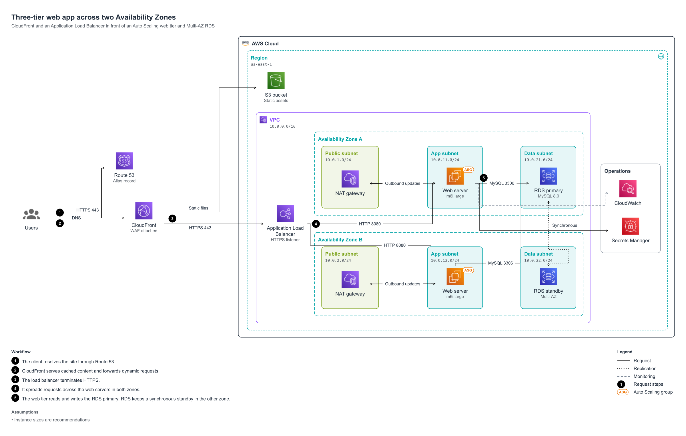 | 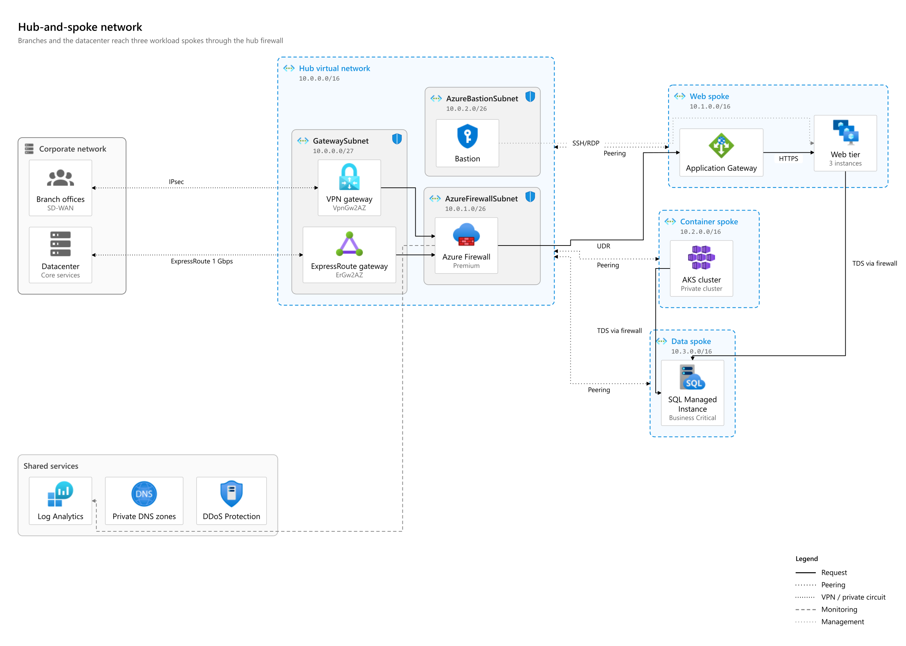 |

| Kubernetes: namespaces in a cluster, managed data outside it | Hybrid analytics: each cloud's boundary in its own style |
|---|---|
| 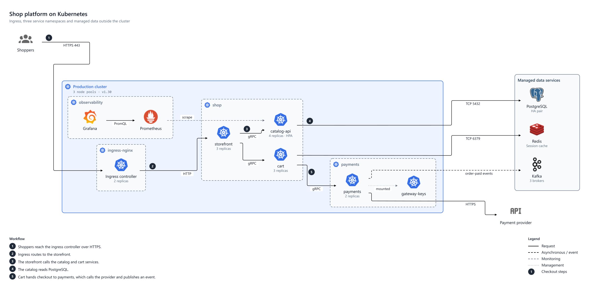 | 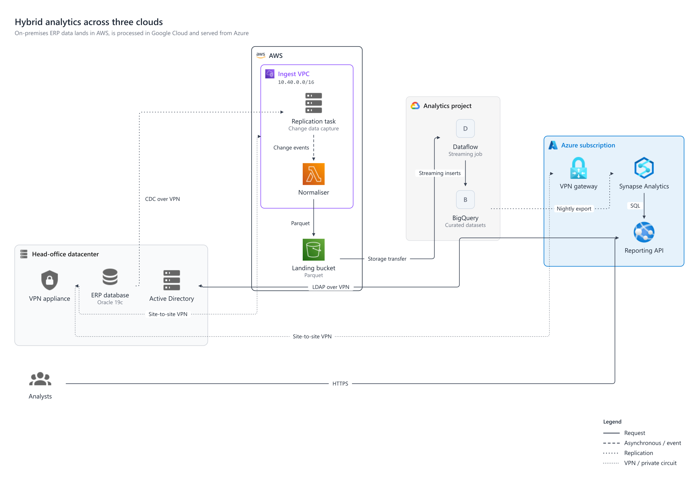 |

Poster diagrams, rendered from the spec fixtures by the app's engine:

| A RAG assistant (flows, a card grid, dashed calls) | A hub-and-spoke network (zones as boundaries) |
|---|---|
| 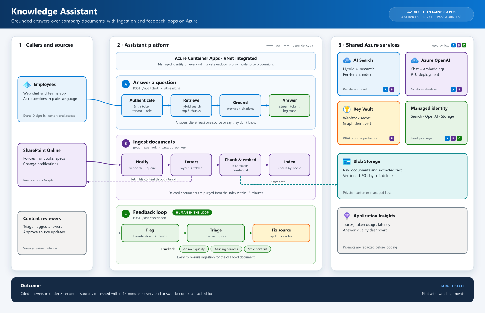 | 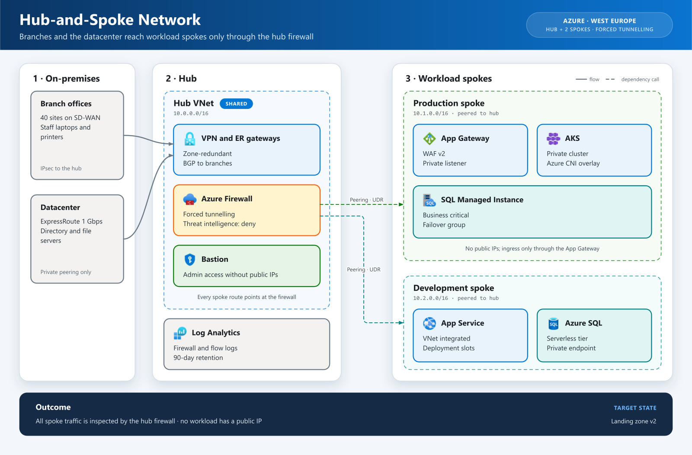 |

Graph-style output from the D2 pipeline (golden fixtures):

| IoT edge-to-cloud | Kubernetes microservices | RAG chat app on Azure |
|---|---|---|
| 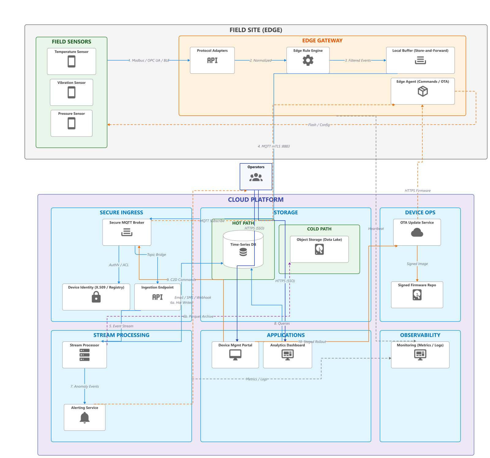 | 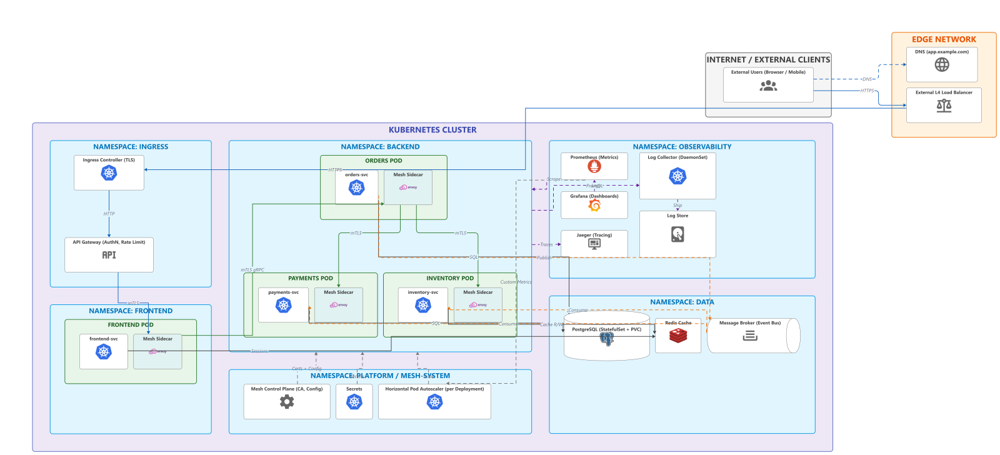 | 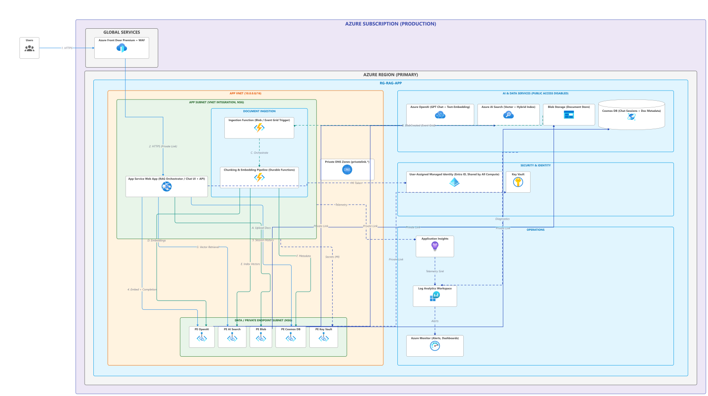 |

| Vision review with suggested fixes | In-app GitHub sign-in |
|---|---|
| 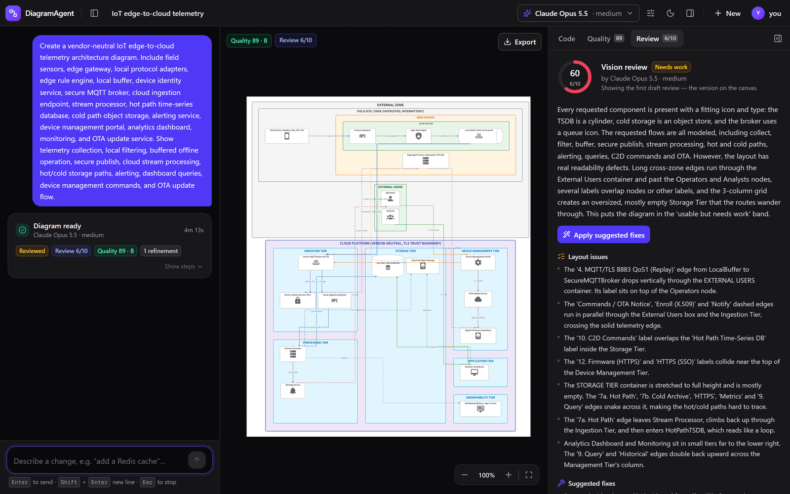 | 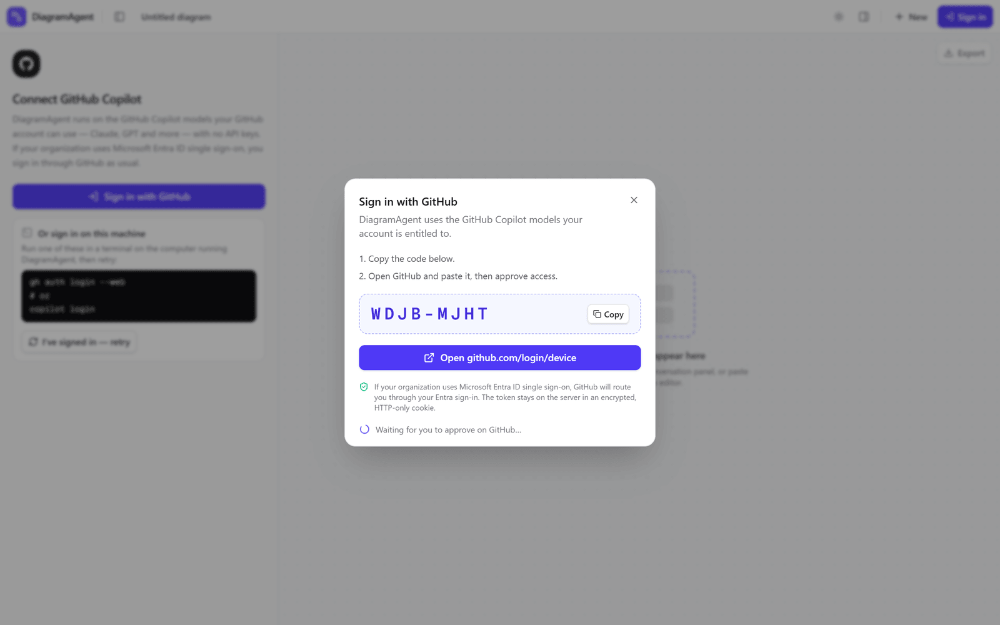 |

Editing on the canvas: a selected group with resize handles, the toolbar (undo/redo, add node or group, connect, align, distribute, delete, Tidy up) and the element editor:

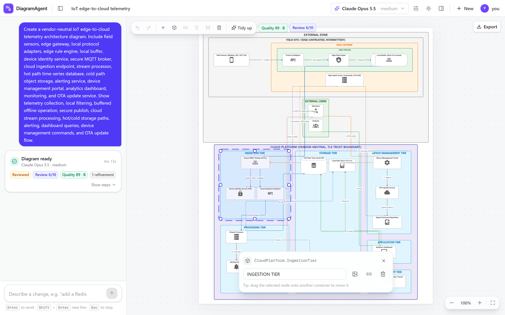

## Configuration

| Variable | Default | Purpose |
|----------|---------|---------|
| `DIAGRAM_AGENT_DEFAULT_MODEL` | `copilot:claude-opus-5.5@medium` | Default model (`provider:model@effort`) |
| `GITHUB_OAUTH_CLIENT_ID` | — | Enables in-app *Sign in with GitHub* (device flow) |
| `DIAGRAM_AGENT_SESSION_SECRET` | per-process random key in dev | Encrypts the session cookie; required in production with in-app sign-in |
| `DIAGRAM_AGENT_ALLOW_MACHINE_LOGIN` | `true` in dev, `false` in production | Let requests use the server machine's GitHub login |
| `DIAGRAM_AGENT_ALLOWED_HOSTS` | — | Extra host names (comma-separated) that may use the machine login besides loopback |
| `DIAGRAM_AGENT_COPILOT_HOME` | `~/.diagram-agent/copilot` | Copilot runtime state directory (kept apart from your `~/.copilot`) |
| `AZURE_AI_FOUNDRY_ENDPOINT` | — | Optional Azure OpenAI / AI Foundry endpoint (Entra ID auth) |
| `DIAGRAM_AGENT_AZURE_USERS` | — | GitHub logins (comma-separated, or `*`) allowed to use the Azure models besides the machine login |
| `DIAGRAM_AGENT_RENDER_TIMEOUT_MS` | `45000` | Per-step D2 layout/render limit before the renderer is recycled |
| `DIAGRAM_AGENT_RENDER_QUEUE_LIMIT` | `8` | Renders allowed to wait for the (single) D2 engine before `/api/render` answers 503 |

## Security

- No keys or tokens in the repo; `.env*` is git-ignored and CI runs a full-history [gitleaks](https://github.com/gitleaks/gitleaks) scan on every push and PR.
- API routes accept JSON only, reject cross-site/cross-origin browser requests, and cap request bodies (413) — a random web page can't spend your Copilot quota through your browser.
- Every model, render and export route needs a credential: an in-app sign-in, or the machine login where it's allowed (see above).
- Rendered SVG is sanitised (DOMPurify) before it is inserted into the page, because labels, links and tooltips are model-generated.
- Errors returned to the browser never include upstream payloads or stack traces.

## Project structure

```
src/
├── app/
│   ├── page.tsx                 # Workspace: top bar, conversation, canvas, inspector
│   └── api/                     # auth/*, models, clarify, plan, generate (SSE), assess, render, export/*
├── components/                  # UI (ModelCanvas, CanvasToolbar, ElementEditor, ConversationPanel, RunCard, Inspector, …)
├── hooks/                       # useDiagramDocument (model + undo), useDiagramAgent (conversation + pipeline), useCopilot, …
└── lib/
    ├── arch/                    # Architecture spec: schema, normaliser, ELK layout engine and polish passes, style packs, page blocks, architect prompt, quality and faithfulness checks
    ├── compose/                 # Poster spec: normaliser, layout engine, content layout, theme, quality, composer prompt
    ├── eval/                    # eval logic: verdicts and summaries, the blind judge, faithfulness expectations, engine-neutral layout metrics, the Graph decision rule
    ├── model/                   # diagram model: operations, stable merge, router, renderers, D2 import/export, draw.io/Visio/Mermaid/Excalidraw
    ├── llm/                     # Copilot SDK provider, optional Azure provider, model selection
    ├── auth/                    # device flow, sealed session cookie, machine-login policy
    ├── pipeline/                # prompts, server steps, pure refine loop shared by UI and evals
    ├── quality/                 # deterministic diagram scoring
    ├── d2-render.ts             # D2 WASM compile (automatic layout)
    └── svg-raster.ts            # SVG → PNG with embedded icons and fonts
evals/                           # live eval cases (cases.json) and the held-out set (held-out.json)
scripts/                         # compose.ts (render a spec from the command line), eval-diagrams.ts (eval harness), eval-paired-d2.ts (Graph vs Architecture), eval-rescore.ts
```

## License

MIT — see [LICENSE](LICENSE). Bundled icons are third-party assets; see [THIRD_PARTY_NOTICES.md](THIRD_PARTY_NOTICES.md).
