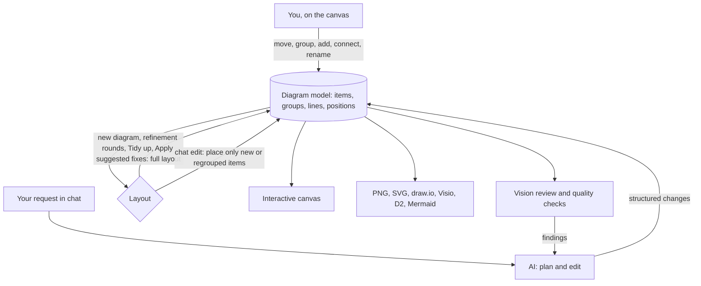

# Editable diagram canvas on a model we own

## Problem Frame

Every diagram is currently D2 text, laid out by D2's automatic layout and shown as a static SVG. That makes the app rigid:

- **No hand-editing.** You can't adjust a diagram by hand. Every change re-runs the whole layout, so the diagram jumps.
- **No layout tuning.** The D2 npm package only lets us pick the engine (`dagre` or `elk`), not tune it. Lines between groups come out diagonal and are patched afterwards (`src/lib/svg-orthogonal.ts`). Layout quality has stalled: the vision reviewer scores every eval case 6/10, and 6 of 10 cases fall outside the quality check's aspect-ratio pass band (0.6–2.6).
- **D2 syntax is a failure point.** The model writes D2 text, so syntax errors cost fix rounds. D2's scoping rules also create duplicate "phantom" nodes when a connection uses a shortened name.
- **Exports don't match the canvas.** `src/lib/d2-to-drawio.ts` re-parses the D2 text with its own parser and lays nodes out in a simple grid. `src/lib/d2-to-vsdx.ts` reuses that parser.
- **D2 itself is a project risk.** Terrastruct, the company behind D2, is shutting down. D2 continues as a non-profit (fiscally sponsored by Hack Club) with a part-time maintainer. TALA, D2's architecture-focused layout engine, is now open source but isn't in the npm package the app uses.

Users want five things: hand-editing, better layouts, draw.io and Visio files that match the canvas, more kinds of diagrams, and control over styling. This first release is built around **hand-editing**. Building it on a diagram model we own is also what makes matching exports and styling cheap afterwards.

**Durable capability (6–12 months):** one architecture model that both the user and the AI edit, drawn on an interactive canvas and exported to any notation.

## Requirements

**Diagram model**
- R1. The diagram model is the single source of truth for every diagram. It holds nodes, groups and their nesting, connections, labels, icons, styles, and positions and sizes. The canvas, exports, quality checks and vision review all read from it. (Here, *nodes* are single components such as services, resources and actors; *groups* are containers such as regions, networks, subnets and tiers; *items* means either.)
- R2. The AI creates and changes diagrams as structured changes to the model, checked before they're applied. Invalid AI output is rejected or repaired; D2-style syntax-fix rounds go away.
- R3. The first draft of a new diagram is built from the planner's structured output, without a separate "write D2" model call. Planning may add a model-level refinement step if first-draft quality needs it (see Outstanding Questions).
- R4. Diagrams persist in the browser as they do today, positions included, and survive reloads.

**Canvas editing (first release)**
- R5. Drag nodes and groups to move them.
- R6. Drag nodes into and out of groups. Groups grow to fit their contents and can be resized by hand.
- R7. Add a node from an icon palette searchable by service name, and add groups.
- R8. Connect two nodes; rename nodes, groups and connections; change a node's icon; delete anything.
- R9. Select several items (modifier-click, or Shift-drag a selection box; a plain drag on empty canvas still pans, as today), move them together, and align or distribute them.
- R10. Undo and redo cover both hand edits and AI edits. Keyboard shortcuts cover delete, nudge, undo/redo and select all, and today's zoom and pan shortcuts keep working.
- R11. Lines route themselves: right-angled, avoiding nodes, with readable labels. They re-route when things move.
- R12. While an AI run is changing the diagram, hand edits are blocked, as they are today.

**Layout behaviour**
- R13. A new diagram gets a full automatic layout.
- R14. **Stable by default.** AI edits never move anything already on the canvas, except items the request itself moves or regroups (for example, "move the database into the data subnet"). New items go next to what they connect to, inside the right group, and groups grow to make room. R22 covers generation runs and reviewer fixes.
- R15. A **Tidy up** action re-runs the full automatic layout on demand, and it can be undone.
- R16. When an AI edit adds or regroups many items, the app suggests Tidy up instead of re-laying out silently.
- R17. Automatic layout controls aspect ratio (no long, thin strips) and routes lines between groups at right angles.
- R22. **Reviewer fixes and stability.** During a generation run (the first draft and its refinement rounds), the layout can change freely, since nothing has been placed by hand yet. After the run, stable by default (R14) applies to chat edits. *Apply suggested fixes* is an explicit request to improve the layout, so it may re-lay out the diagram as one undoable step, warning first if the diagram has been arranged by hand.

**Code tab, import and export**
- R18. The Code tab becomes read-only exports generated from the model: D2, Mermaid and draw.io XML.
- R19. A one-way D2 import turns D2 text into the model. Diagrams saved by the current version open automatically, and users can paste D2 from elsewhere. Anything the model can't represent is reported, not silently dropped. The original D2 is kept, so a failed import loses nothing.
- R20. PNG, SVG, draw.io and Visio exports use the model's real positions and sizes, so they match the canvas: icons, labels, groups and lines.

**Review and quality**
- R21. These keep working on the new model and renderer:
  - the vision review, including *Apply suggested fixes*
  - the deterministic quality checks
  - the refine loop
  - the live eval harness and the golden fixtures

## Success Criteria

- On the 10 live eval cases (`evals/cases.json`):
  - Every case renders.
  - Deterministic quality is at least today's (82–90).
  - Vision review scores at least today's 6/10, with a stretch goal of the 7/10 pass mark.
  - At least 8 cases are inside the aspect-ratio pass band. Today only 4 are.
- **Hand edits survive AI edits.** After three chat edits in a row that add items, every existing item is exactly where it was.
- **Exports match.** Node positions and sizes in the draw.io and Visio exports equal the canvas to within 1 px (after unit conversion), and PNG and SVG exports look the same as the canvas.
- **Runs are no slower.** A new-diagram run is no slower than today's 4–6 minutes (Opus 5.5 at medium, one refinement round). It's expected to be faster, since one model call goes away.
- **Nothing is lost on import.** Diagrams saved by the current version and the golden fixtures import with no lost components or connections.

## Scope Boundaries

- No hand-drawn line routing (dragging bend points) in the first release.
- No editable text source. The Code tab shows read-only exports, and D2 import is one-way.
- No new diagram kinds with their own notation yet (sequence diagrams, C4 views, formal data-flow diagrams). Today's architecture-style diagrams, including network topologies and data pipelines, stay fully supported. The model shouldn't rule the new kinds out, but they aren't built now.
- No styling beyond today's look (themes, official vendor icon sets).
- No embedded draw.io editor; draw.io is an export target only.
- No real-time collaboration or multiplayer.

## Key Decisions

- **Our own canvas on a model we own**, rather than embedding the draw.io editor or staying on D2 with TALA's pinned positions. It's the only option where you and the AI edit the same diagram and each other's changes survive. Embedding draw.io makes it hard to merge AI changes into hand edits. D2 with TALA stays text-driven, and TALA can reshuffle the whole diagram when one node is added.
- **Hand-editing first.** It forces the model-first foundation that matching exports and styling build on.
- **Stable by default, with an explicit Tidy up.** Predictability beats automatic re-layout once someone has arranged a diagram.
- **Code tab becomes read-only exports, plus a one-way D2 import.** This avoids two editors that must agree on every change. D2 also can't store hand-set positions under ELK.
- **Full editing set without hand-drawn line routing.** This was chosen on the user's behalf while they were unavailable. Revisit if needed.
- **Layout is free during a generation run and stable after it; Apply suggested fixes may re-lay out** (R22). Without this, stable by default would stop the refine loop and the reviewer's fixes from improving the layout, which is their main job. This was also chosen on the user's behalf while they were unavailable. The alternative was "always stable, with Tidy up for layout problems".

## Dependencies / Assumptions

- D2 stays in the codebase for import and as an export format. It stops being how the canvas is laid out and drawn, unless the layout comparison (below) picks D2, with ELK or TALA, as the engine for full layouts.
- The planner's JSON (`components`, `hierarchy`, `connections`; see `src/lib/pipeline/prompts.ts` and `src/lib/plan-to-d2.ts`) is a sound starting point for the model. It will need stable IDs, positions, sizes and styles.
- *Unverified assumption:* new items can be placed next to their neighbours, with groups growing to fit, deterministically and without moving existing items. This needs design in planning.

## Outstanding Questions

### Resolve Before Planning

None.

### Deferred to Planning

- [Affects R13, R17][Needs research] Which layout engine should do full layouts? Candidates:
  - today's D2 + ELK positions, which the existing npm package already returns (this guarantees day-one parity)
  - ELK.js in the app with tuned settings
  - D2 with TALA via the D2 CLI on the server
  - a mix, for example TALA for first drafts

  Decide with a side-by-side comparison on the 10 eval plans already on disk, scored by the existing quality checks and vision reviewer.
- [Affects R5–R11, R20, R21][Technical] Should the canvas use a library such as React Flow (MIT) or a custom SVG renderer? Either way it needs nested groups, lines drawn along routed bend points, and labels on lines. The canvas, the PNG and SVG exports, and the image the reviewer sees must come out identical, ideally from one renderer.
- [Affects R11, R14][Needs research] Lines must re-route around nodes that don't move (R11 with R14), which a layered layout engine doesn't do on its own. Which line router works with fixed node positions (for example, an orthogonal connector router such as libavoid), and is its licence acceptable?
- [Affects R14, R16][Technical] What algorithm places new items near their neighbours and grows groups without moving existing items? What threshold triggers the Tidy up suggestion?
- [Affects R2, R21][Technical] Should AI edits be whole-model rewrites or change operations? How are IDs kept stable across edits, and how does the refine loop apply reviewer fixes?
- [Affects R21][Technical] How does the vision reviewer get an image, and how do the quality checks read positions and line routes from the new layout? Does the reviewer's rubric, calibrated on D2 renders, need recalibrating for the new look?
- [Affects R19][Technical] How does D2 import map D2's compiled graph onto the model, and how are unsupported parts (sequence diagrams, tables, custom styles) reported?
- [Affects R20][Technical] Rework the Visio export (`src/lib/d2-to-vsdx.ts`) to use model positions.
- [Affects R3][Needs research] Does a first draft built straight from the planner match today's quality, or is a model-level refinement step still needed?

## Next Steps

→ `/ce-plan` for structured implementation planning, starting with the layout-engine comparison.
