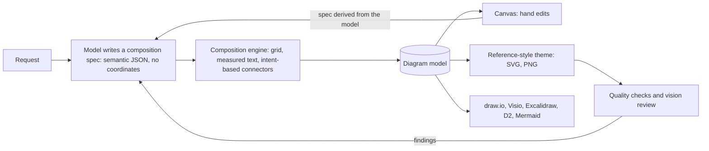

# Composed architecture diagrams: designed layouts any model can produce

## Problem Frame

Generated diagrams still look "all over the place". Milestone 1 made them editable, but they are still laid out by generic graph layout: D2's layout engines for new diagrams and our router for edits. Graph layout optimises edge routing, not reading order. The result:

- uneven density
- long lines that cross the canvas
- no visual hierarchy
- no narrative

The vision reviewer plateaus around 6/10.

A diagram a person composes in a whiteboard tool such as Excalidraw and then polishes into an SVG reads differently. The user supplied a hand-composed reference, kept outside the repo. It has:

- **Structure first:** a header band with the system's name and platform badge; numbered columns that tell a left-to-right story (who calls in, the workload, what it depends on); and an outcome footer.
- **One lane per end-to-end flow:** lettered lanes with a short row of steps joined by short arrows, a code subtitle naming the trigger, and a one-line invariant underneath.
- **Few, deliberate lines:** a curved arrow from each caller into its lane, dashed elbows through the gutters for dependency calls, and "used by flow A/B/C" chips on shared services instead of a line to every consumer.
- **Semantic colour:** one tone per concern (blue request path, purple async, green identity and governance, orange secrets and controls, grey operations), with fills only on leaf cards.
- **A consistent grid:** equal-height column panels, fixed margins and gutters, and a type scale.

A designer gets there by **composing**: choosing the structure, then placing it on a grid. Models are good at deciding structure and bad at coordinates. An engine is the reverse. So we split the job.

## Requirements

**Composition spec (the language models write)**
- R1. A small grammar of semantic JSON with no coordinates:
  - a page `title`, `subtitle` and optional `badge`
  - 1–4 `columns`, each with a `title`, a `size` hint and ordered `items`
  - items:
    - `card`: title, 0–4 lines, note, tone, icon, used-by chips
    - `grid`: 2–3 columns of cards
    - `banner`: full-width context strip
    - `flow`: a lettered lane with 2–6 steps, subtitle, tag, notes and chips
  - `connectors` with an intent: `flow` or `call`
  - an optional `footer`
- R2. Parsing is lenient but bounded. It accepts common aliases (`lane`/`flow`, `description`/`lines`, `color`/`tone`), missing ids (derived from titles), references by id or title, and prose or code fences around the JSON. It reports what it repaired. Hard limits cap size and text length. Unknown references and icons are dropped with a warning; they are never fatal.
- R3. The language is documented and portable so any model or agent can use it:
  - a composition guide and JSON Schema in `docs/`
  - a CLI that renders a spec file to SVG or PNG
  - the app accepts a pasted spec, alongside D2, in Import

**Composition engine**
- R4. Deterministic: the same spec always produces the same model and a byte-identical SVG.
- R5. Grid tokens: 40 px margins, 32 px gutters, 20 px item gaps and 24–28 px panel padding. Column widths come from `size` hints, bounded below by what the content needs. The canvas width is chosen so the finished page lands near a 1.3–1.9 aspect ratio.
- R6. Text is measured and wrapped with conservative font metrics, so nothing overflows its box. Ellipsis is a last resort and is reported to the quality checks.
- R7. Column panels have equal heights. Shorter columns spread the spare room, widening gaps first and then stretching cards, with notes kept at the bottom.
- R8. Flow lanes:
  - a badge, title, code subtitle and optional tag
  - steps in a row joined by short arrows, stacked vertically when the column is too narrow
  - notes and chips below
- R9. Connectors are drawn by intent:
  - `flow`: solid S-curves between columns
  - `call`: dashed orthogonal elbows through the gutters, labelled just above the line
  - step arrows inside lanes are drawn automatically
  - no connector crosses an unrelated card
  - shared services show used-by chips instead of lines
- R10. Legends appear only when they're needed: the line kinds in the workload column, and the used-by flows in columns with chips.

**Theme**
- R11. The reference-style theme uses:
  - the Fluent palette in seven semantic tones (blue, purple, green, orange, red, teal, grey)
  - a gradient header band with a badge pill; white column panels with soft shadows; a dark footer band
  - lane badges, pills and chips
  - the Segoe UI type scale with system fallbacks
  - optional product icons on cards and steps

**Integration**
- R12. New diagrams are composed by default. "Graph (automatic D2 layout)" stays available as a setting, and D2 import still produces free-form graph diagrams.
- R13. The spec is the AI's editing language for composed diagrams. A chat edit sends the current spec and receives a complete updated spec, which recomposes deterministically: untouched sections stay where they were, and only the edited column reflows.
- R14. The canvas keeps hand-editing on composed diagrams: rename, edit details and tone, delete, add, connect, drag and resize. The spec is derived from the model, so hand edits carry into the next AI edit. Tidy up recomposes from the derived spec. Hand moves last until the next AI edit or Tidy up.
- R15. The Code tab shows the spec (copyable), alongside the D2 and Mermaid exports.
- R16. Existing exports keep working:
  - SVG and PNG look exactly like the canvas
  - draw.io and Visio keep titles, details and colours
  - D2 and Mermaid keep the structure
  - a new Excalidraw export (`.excalidraw`) lets people keep sketching

**Quality loop**
- R17. Composition-aware quality checks: text fit, overlaps, connectors through cards, aspect ratio, density, column balance, and unresolved references or icons. Graph-only checks such as orphans and layout direction don't apply.
- R18. The refine loop works on the spec:
  - JSON or spec errors produce a repair prompt listing the exact problems
  - reviewer findings produce spec edits
  - the best candidate still wins
- R19. It works across model families. The composer prompt is self-contained (grammar, design rules and two original examples) and is exercised with more than one model.

## Success Criteria

- Across the eval cases, the vision reviewer averages **8/10 or more** for composed diagrams, against about 6/10 for the graph pipeline.
- Every composed eval output has no overlaps, no text overflow, and an aspect ratio between 1.2 and 2.0.
- A valid spec on the first attempt in 90% or more of runs across two model families, and at most one repair round otherwise.
- Keyword coverage at or above the graph pipeline's.
- A chat edit that adds one component moves nothing outside its column.

## Scope Boundaries

- Composition mode doesn't lay out arbitrary graphs; graph mode remains for that.
- There are no manual bend points, no theme editor and no dark diagram theme. The canvas chrome still follows the app theme.
- Only architecture and solution overviews; no sequence, ER or other diagram types.
- The reference diagram and its content are never committed; examples and fixtures are original.

## Key Decisions

- **Semantic spec, not coordinates.** Coordinates are where models are weakest and least consistent. Structure is where they are strongest. Coordinate-level output from models, in Excalidraw's style, was rejected as heavy and inconsistent across models.
- **The diagram model stays the document; the spec is derived from it.** Canvas operations, undo, persistence and exports keep working unchanged, and hand edits flow into AI edits without a second source of truth.
- **The engine owns polish.** Spacing, alignment, wrapping, equal heights and connector routing are deterministic, so every model gets the same finish.
- **Constraining D2 with grids was rejected.** It still looks like D2 and keeps D2's layout limits.
- **Graph mode stays.** Imported D2 and dense topologies still need free-form graph layout.

## Dependencies / Assumptions

- Segoe UI is the primary font; system fallbacks are wider. Text is measured with conservative metrics plus slack, so fallback fonts don't overflow.
- Icons come only from the vendored set in `public/icons` (no remote URLs).

## Outstanding Questions

### Deferred to Planning
- [Affects R5, R7][Technical] The exact column width heuristic and the aspect-ratio search (try a few canvas widths, keep the best).
- [Affects R18][Needs research] Whether a separate planning call improves composed output, or the composer plans in one call. Start with one call.

## Next Steps

→ `/ce-plan` for structured implementation planning.
