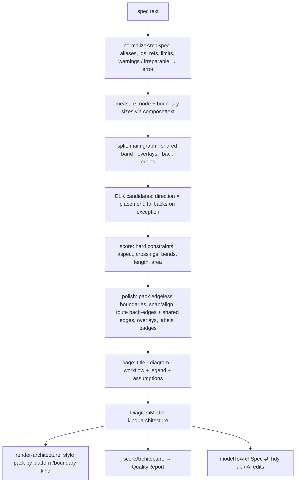
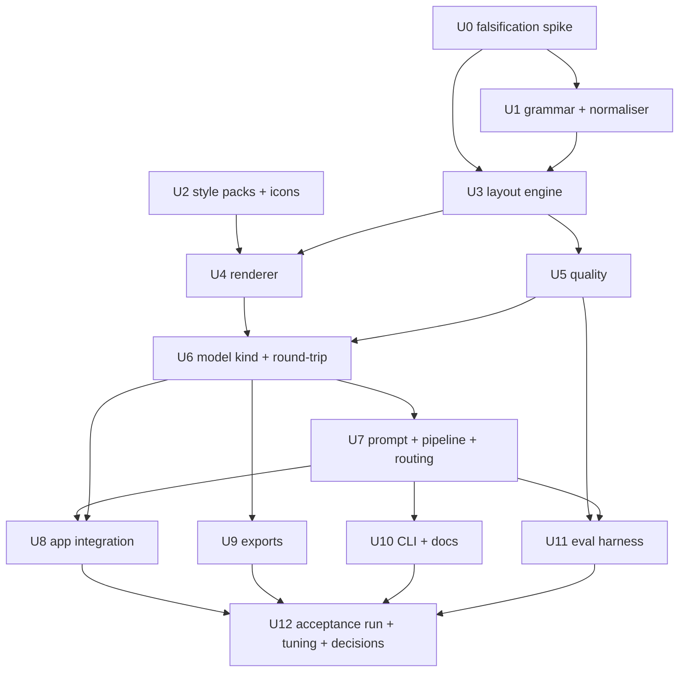
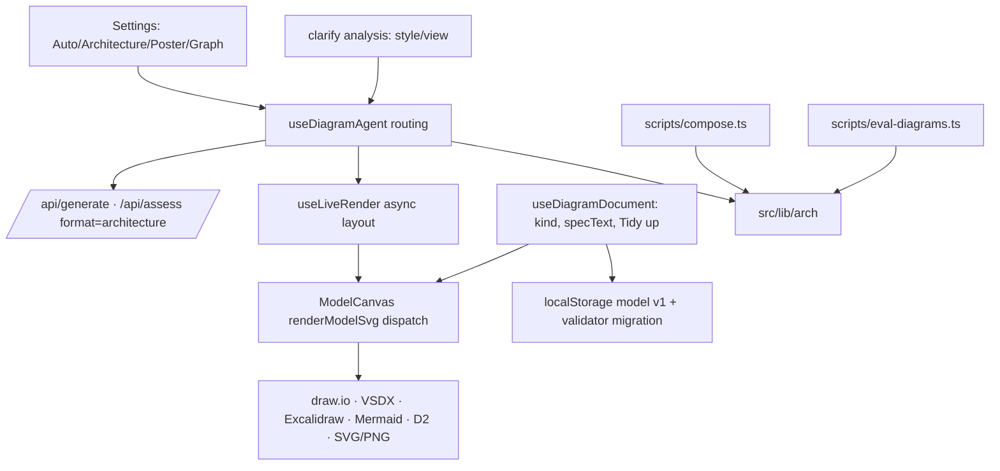

# feat: Reference-architecture diagrams

## Overview

Add a third diagram engine, **Architecture**. A model describes a system as a topology:
- components with service icons and details
- nested, typed boundaries
- connections with a meaning and a protocol label
- numbered step sequences
- assumptions

A deterministic engine lays the topology out with a compound-graph layout plus designer polish, and renders it in the published conventions of the platform it depicts (Azure Architecture Center, AWS Architecture Icons, Google Cloud, Kubernetes, or a neutral Eraser-like style).

An **Auto** style setting routes each request by intent: Architecture for infrastructure, deployment and network views; the existing Poster for overviews. The D2 Graph style stays until a paired comparison decides its fate. The work is gated by a falsification spike, and success is measured with an independent judge, faithfulness checks and a held-out set (see origin: `docs/brainstorms/2026-09-29-reference-architecture-diagrams-requirements.md`).

## Problem Frame

The Poster engine forces every diagram into one template: header band, numbered columns, lettered lanes, card grids, footer. It also drops the low-level detail that architecture diagrams exist to show: concrete components with icons, the network boundaries they live in, and what flows between them over which protocol. The user wants the diagrams to look and read like reference architectures from Microsoft, AWS and Google, and like Eraser.io's clean automatic diagrams. The style should follow the content rather than a template, and detail must be trustworthy. (See origin.)

## Requirements Trace

- R1–R3 **Intent and trust:** Auto style routing, a view and detail level chosen from the prompt, and the trust policy with an Assumptions note. → U7, U8
- R4–R7 **Visual language:** Architecture anatomy, platform conventions by boundary kind, page hierarchy, and components without icons. → U2, U4, U3
- R8–R13 **Detail:** component details, boundary facts, connector meanings and labels, two step sequences, redundancy, the shared-services group. → U1, U3, U4
- R14–R16 **Layout:** hard constraints versus goals, consistent sizing, and the v1 support envelope. → U0, U3, U5
- R17–R19 **Grammar, input contract and prompt.** → U1, U7, U10
- R20–R22 **App integration:** canvas editing, Tidy up and AI edits, export tiers, existing documents, and the D2 decision. → U6, U8, U9, U12
- R23–R26 **Quality measurement:** independent judge, faithfulness, tuned, held-out and paired cases, and deterministic fixtures. → U3, U5, U11, U12
- Success Criteria (origin) → U12 acceptance run

## Scope Boundaries

Carried from the origin:
- no pixel-perfect clones of provider templates
- style packs only for the boundary kinds listed in R5
- no freeform drawing tool, and no reflow on small screens
- no new icon libraries: gaps are filled only from official sources whose licence allows it, with generic fallbacks otherwise
- Poster is kept but not developed
- no cost, compliance or security scoring

Additionally:
- no server-side layout: Architecture lays out in the browser, the CLI and evals, as Poster does
- no collaborative editing
- Graph (D2) generation code is not deleted in this plan, even if the comparison recommends removing it from the picker

## Context & Research

### Relevant Code and Patterns

- **Poster engine to mirror, not generalise:**
  - `src/lib/compose/normalize.ts`: lenient normaliser, `FIELDS` allow-list with did-you-mean, warnings deduplicated
  - `src/lib/compose/layout.ts`: width search and scoring, `placeLabels` collision pass
  - `src/lib/compose/quality.ts`: `scoreComposition` produces a `QualityReport`
  - `src/lib/compose/from-model.ts`: model-to-spec round-trip
  - `src/lib/compose/index.ts`: `composeText`, `recompose`
  - `src/lib/compose/partial.ts`: `completePartialJson`, `looksLikeSpec`
  - `src/lib/compose/prompt.ts`: composer prompt, `COMPOSITION_LANGUAGE`, assessment addendum
  - `scripts/compose.ts`: CLI with `--json`, `--strict`, `--stdin`
- **Shared utilities to reuse:**
  - `src/lib/compose/text.ts`: linear `measureText`, `wrapText`, `fitLine`
  - `src/lib/model/route.ts`: `routeEdge`, `routeModelEdges`, the orthogonal obstacle-avoiding router, used here for back-edges and re-routing after polish or hand moves
  - `src/lib/model/ops.ts`: `clearAffectedRoutes`
  - `src/lib/model/validate.ts`: `MODEL_LIMITS`, `validateModel`
  - `src/lib/svg-raster.ts`: `svgToPng`, `inlineVendoredIcons`
  - `public/icons/manifest.json`: icon registry
- **Model and rendering seams:**
  - `src/lib/model/types.ts`: `DiagramModel.composed`, `NodeRole`, `NodeContent`, `EdgeKind`
  - `src/lib/model/render-svg.ts`: `renderModelSvg` and `modelBounds` dispatch on `model.composed`
  - `src/components/ModelCanvas.tsx`: renders `renderModelSvg(model)` and overlays interactions by `data-id`
  - about 15 `.composed` checks across `src/app/page.tsx`, `src/components/{DiagramCanvas,ElementEditor}.tsx`, `src/hooks/useDiagramDocument.ts`, `src/app/api/{render,export/png}/route.ts`, `src/lib/model/{to-drawio,to-vsdx,to-excalidraw,validate}.ts` and `src/lib/compose/index.ts`
- **Pipeline seams:**
  - `src/lib/pipeline/refine-loop.ts`: the `PipelineLanguage` interface
  - `src/lib/pipeline/server.ts`: `runGenerate` and `runAssess` choose prompts by `DiagramFormat`
  - `src/lib/api/schemas.ts`: format enum
  - `src/lib/client/api.ts`: format type
  - `src/hooks/useDiagramAgent.ts`: `DiagramFormat`, `newFormat` from `settings.style`, `DEFAULT_SETTINGS`
  - `src/lib/llm-schemas.ts`: the clarify `analysis` is free-form (`unknown`), so it can carry style and view without a schema break
  - `src/lib/pipeline/prompts.ts`: `CLARIFY_SYSTEM_PROMPT`, `PLAN_SYSTEM_PROMPT`
- **Live preview and document:**
  - `src/hooks/useLiveRender.ts`: synchronous compose snapshot with a streaming throttle
  - `src/hooks/useDiagramDocument.ts`: Tidy up, `specText`, `currentFormat`, `acceptRunSpec`
- **Evals:** `scripts/eval-diagrams.ts` (`--format`, `--reviewer`, `--refinements`) and `evals/cases.json` (10 cases with `expect.keywords` and `minNodes`).

### Institutional Learnings

- There is no `docs/solutions/`. Lessons carried from the Poster milestone:
  - Measure text rather than estimate it.
  - Keep geometry deterministic, and search candidates rather than tuning one configuration.
  - Every repair must produce a warning.
  - Validators must accept everything the engine emits at the limits.
  - Fixtures must use original content only.
  - The machine is heavily loaded: run tests serially.

### External References

- **Microsoft Azure Architecture Center** reference diagrams, studied as downloaded images (never committed):
  - "Baseline highly available zone-redundant web application"
  - "Hub-spoke network topology"
  - "Baseline Microsoft Foundry chat"

  They show icon-first nodes with labels below, a VNet with subnets, private endpoints lined up with their services, yellow availability-zone boxes, identity and monitoring grouped at the edge, and green inbound or blue outbound step badges with a legend.
- **Eraser.io** cloud diagrams (docs.eraser.io, "Cloud architecture diagrams" and "Architecture diagram syntax"). The grammar is nodes (icon, colour, label), nested groups (icon, colour), connections (`>`, `<`, `<>`, `-`, `--`, `-->`) with labels, direction, and a legend. Default direction is right, with tinted groups and pill titles.
- **Layout library:** elkjs 0.12.0 (EPL-2.0 or GPL-3.0), layered algorithm, `hierarchyHandling: INCLUDE_CHILDREN`, orthogonal routing.
- **Spike findings**, from a scratch spike outside the repo: ELK produces Microsoft-like structure for the zone-redundant web app. Its failure modes were:
  - group titles wider than their groups, fixed by minimum sizes
  - the author's order ignored inside groups with no internal links
  - cycles creating loops, fixed by excluding the back-edge and routing it after layout
  - aspect ratio swinging from 0.66 to 3.3 depending on options
  - a hard crash (`TypeError`) when model-order options are set on child graphs
- **AWS Architecture Icons** and **Google Cloud** diagram guidelines. The exact group colours and styles come from a research pass; their values are recorded in U2.

## Key Technical Decisions

- **Separate `src/lib/arch/*` modules rather than generalising the poster modules.** Poster semantics (columns, lanes, single-level zones, container-to-flow conversion) would flatten nested boundaries and connection meaning. Shared utilities are reused (text, partial JSON, router, validator, raster, CLI patterns), but the grammar, normaliser, layout, round-trip and scorer are Architecture-specific.
- **Nested JSON grammar in the Eraser style, with ids and `parent` accepted as an alias.** Nesting prevents containment cycles by construction and matches how architects think. A flat `parent` form is still accepted, because models sometimes emit it, and it is validated for cycles (R18).
- **elkjs layered compound layout plus our own polish passes, with an async API.** It is proven for compound graphs with orthogonal routing and has the options we need, where D2 exposes almost none.
  - It loads lazily in the browser and imports directly in Node.
  - Candidates vary by direction and node placement, and the best score wins deterministically.
  - Any ELK exception falls back to a safer option set. If every ELK call fails (or the library fails to load), a **terminal fallback that doesn't use ELK** takes over: deterministic recursive boundary packing (ordered rows and grids) plus orthogonal routes from `src/lib/model/route.ts`, with a warning. So layout never fails for valid input.
  - **Browser work is single-flight.** At most one layout runs at a time, and only the newest pending spec runs next. While a spec streams, the preview uses one fast candidate with no candidate search. A browser performance gate in U8 decides whether a web worker is required before Auto becomes the default.
- **The polish passes the spike showed are needed:**
  - boundaries with no internal links are packed as ordered rows or grids, in author order
  - measured minimum sizes for boundary titles
  - back-edges and edges into shared services are routed after layout with `src/lib/model/route.ts`
  - 8 px grid snapping and alignment of near-equal centres
  - label collision avoidance
  - step-badge placement
  - page composition: title above; workflow list, legend and assumptions below
- **A model discriminator:** `DiagramModel.kind?: "poster" | "architecture"` with a `diagramKind(model)` helper that replaces direct `.composed` checks. Legacy `composed: true` reads as `"poster"`. When both are present, `kind` wins and the validator drops `composed`. It was chosen over a second boolean, which would allow contradictory states.
- **A lossless spec-to-model projection.**
  - Architecture nodes carry an `arch` metadata object: the stable spec id, boundary kind, an optional per-boundary platform override, and detail or facts.
  - Path ids stay the canvas identity, so `src/lib/model/ops.ts` reparenting keeps working. The spec id survives reparenting and renames, and `modelToArchSpec` round-trips through it.
  - Overlays, sequences, assumptions, title, subtitle and platform are canonical **model-level** fields.
  - Edges carry `meaning`, `badges` and a validated `hidden` flag for suppressed shared-service links. `routeModelEdges` and every renderer and exporter skip hidden edges, and round-trip keeps them.
- **Page elements are generated projections.** Title, legend, workflow and assumptions are model nodes with new roles and a `generated` marker, so the canvas and exports place them uniformly. The canonical data is the model-level fields above.
  - Projections are regenerated on every layout and every edit of those fields, and are excluded from `modelToArchSpec`.
  - Generic move, reparent, connect and delete operations skip them. Editing the title node in the element editor edits `model.title`.
  - The legend's entries are derived from the meanings and sequences in use.
- **Style packs as data:** `platform → boundary kind → style` and `meaning → line style`, plus badge styles per sequence index and typography.
  - The platform is inferred from the majority of icon prefixes, with an explicit override.
  - In mixed diagrams, each boundary picks its own platform's convention.
  - Unknown kinds fall back to generic (R5).
- **Spanning boundaries** (an AWS auto-scaling group across AZs) are canonical model-level **overlays** with member spec ids, because strict nesting cannot express them.
  - The renderer and exporters compute each overlay's box from its members' current boxes, so overlays follow hand moves.
  - Clean overlay placement (no non-member inside the box) is part of candidate scoring.
  - If no candidate places an overlay cleanly, it is never dropped. The fallback is a membership tag on each member (for example "ASG") plus a legend entry naming the members, and structural faithfulness checks that the relation is present.
- **Intent routing** reads `style` and `view` from the clarify step's `analysis` when clarify runs. They are parsed through explicit enums; malformed or unknown values are ignored.
  - Otherwise a small deterministic keyword heuristic decides: Poster only when overview, journey, process, explainer or roadmap cues appear *without* infrastructure cues, Architecture otherwise, including mixed cues.
  - A frozen, labelled routing corpus sets the accuracy bar.
  - Edits always keep the document's own kind. The run shows the chosen style with a one-click "Redo as …".
- **The clarify step respects the trust policy.** It classifies each request as an existing system or a new design.
  - For an existing system, it asks about essential unknown facts and never puts inferred components in a factual inventory.
  - For a new design, inferred defaults go into `proposed_assumptions`, which the architect prompt turns into the Assumptions note.
- **Evaluation integrity:**
  - The acceptance judge is a fixed model from a different family than the generator (Opus judges GPT-6 output and vice versa), and self-review is reported only as a diagnostic.
  - Each case runs twice per model (`--samples 2`).
  - **Faithfulness is structural.** Required entities are alias groups, flows are alias-group triples, and every concrete fact the spec states (SKU or tier, port, address range, count, version) must appear in the prompt, be allowed by the case, or be listed as an assumption. Prohibited strings are only a secondary check.
  - Held-out cases live in a separate file and run only at the end.
- **Graph documents keep D2.** A D2-backed document's Tidy up always uses the D2 round-trip, and the document never changes kind. "Convert to Architecture" is a separate preview-and-confirm action with a mapping and loss report. The paired comparison (U11, U12) decides only whether Graph stays available for *new* generation.

## Open Questions

### Resolved During Planning

- **Workflow list placement:** below the diagram and inside the image, left; the legend right; the assumptions under the list (origin R6).
- **Spec format:** a separate, versioned Architecture spec (`version: 1`), detected by shape (`items` plus `connections`, with no `columns`), not a generalised CompositionSpec.
- **Where routing happens:** the clarify analysis (`style`, `view`), with the heuristic as fallback. No extra model call.
- **The layout library's licence:** EPL-2.0 or GPL-3.0 dual licence, fine as an npm dependency.
- **Sync or async:** async. The browser render step, Tidy up and the CLI await it; the Poster path stays synchronous.
- **What happens to Graph documents:** imported or generated D2 stays a D2-backed Graph document. Its Tidy up always keeps the D2 round-trip, and it never changes kind. "Convert to Architecture" is an explicit preview-and-confirm action. It builds a spec from the model with `modelToArchSpec` and shows a mapping and loss report before replacing anything. The paired comparison decides only whether Graph stays available for new generation. The origin R22 is updated to match.
- **Nesting versus a conflicting `parent` alias:** nesting wins, and the conflicting alias produces a warning.
- **Over-envelope input:** a lossless degraded mode: one safe candidate, reduced polish, everything kept, and a warning. Beyond an absolute safety cap (about 4× the envelope), the spec is rejected with a `SpecError` and the canvas is not touched.

### Deferred to Implementation

- Exact ELK option sets, candidate count and scoring weights: tuned in U0 and U3 against the spike topologies.
- The label placement algorithm's final form. Start from a port of Poster's `placeLabels` and extend it to badges.
- Which icon gaps can be filled from official sources (licence check per icon), and which use generic fallbacks.
- Whether a web worker is needed: measure after U3 against the R16 budget.
- The final envelope numbers (R16): U0 proposes them, and U3 fixes them before fixtures.

## High-Level Technical Design

> *This illustrates the intended approach and is directional guidance for review, not implementation specification. The implementing agent should treat it as context, not code to reproduce.*

```text
Spec (JSON, no coordinates) — directional sketch
{
  "version": 1,
  "title": "...", "subtitle": "...",
  "platform": "azure|aws|gcp|kubernetes|neutral"   (optional; inferred)
  "view": "deployment|network|application|dataflow|context"
  "items": [
    { "id": "user", "name": "User", "icon": "user" },
    { "type": "group", "kind": "vnet", "id": "vnet", "name": "Spoke VNet", "facts": "10.1.0.0/16",
      "items": [
        { "type": "group", "kind": "subnet", "id": "web", "name": "Web subnet", "facts": "10.1.1.0/24",
          "items": [ { "id": "agw", "name": "Application Gateway", "icon": "azure-application-gateway", "detail": "WAF v2" } ] } ] },
    { "type": "group", "kind": "shared", "id": "ops", "name": "Monitoring", "items": [ ... ] }
  ],
  "overlays": [ { "kind": "asg", "name": "Auto Scaling group", "members": ["web-a", "web-b"] } ],
  "connections": [
    { "from": "user", "to": "agw", "meaning": "request", "label": "HTTPS 443", "step": "in.1" }
  ],
  "sequences": [ { "id": "in", "name": "Inbound", "steps": ["User calls ...", "..."] } ],
  "assumptions": [ "SKUs are recommendations", "Address ranges are illustrative" ]
}
```



## Implementation Units



### Phase 0: Gate

- [x] **U0: Falsification spike and D2 comparison baseline**

**Outcome (see `docs/spikes/2026-09-29-architecture-layout-spike.md`):** go, with required changes.
- Hard constraints held in 7/7, plus 2/2 reserved perturbations.
- Aspect ratio was within 1.2–2.2 for 6/7; D2 managed 1/7.
- The per-topology crossing and loop ceiling failed on the long-chain and dense cyclic topologies. The cause was systematic (connectors routed after layout), not overfitting.
- U3 carries five required changes: crossing-aware routing after layout, a flow-consistency score, performance work, a fallback that doesn't use ELK, and labels that avoid boundary borders.
- The crossing target is revised on the record.

**Goal:** Prove or falsify the compound-layout approach on materially different topologies before building the grammar. Produce the evidence for the D2 comparison.

**Requirements:** R14, R16, R25 (paired comparison), origin Key Decision on the gate

**Dependencies:** None

**Files:**
- Create: `scripts/spikes/arch-layout-spike.ts` (scratch harness, kept for reproducibility; not imported by the app)
- Create: `scripts/spikes/topologies/*.json` (original content: the seven topologies below)
- Create: `docs/spikes/2026-09-29-architecture-layout-spike.md` (results, screenshots referenced from the session folder only, decision)
- Modify: `package.json` (add `elkjs`)

**Approach:**
- Seven original topologies:
  1. Azure zone-redundant web app: private-endpoint alignment and the inbound/outbound cycle
  2. AWS multi-AZ three-tier: Cloud > Region > VPC > 2 AZ × public and private subnets, with an ASG overlay across AZs
  3. Kubernetes platform: cluster > namespaces > workloads, ingress, external data
  4. Multi-cloud with on-premises VPN
  5. Hub-and-spoke with three spokes and ExpressRoute
  6. Microservices with two-way cycles and an event bus
  7. A label-dense data platform with 30+ labelled connectors
- Run each through ELK candidates (RIGHT and DOWN × two node-placement strategies, plus the fallback set) with the minimal polish needed to score. Score with the hard-constraint checks and aspect, crossing and time metrics.
- Convert the same topologies to D2 (containers, labels, icons) and render them through `@terrastruct/d2` with ELK. Score them with the same checks for the paired baseline.
- **Pass thresholds:**
  - hard constraints hold in 7/7 after polish
  - aspect ratio within 1.2–2.2 for at least 5/7
  - at most 3 crossings and no loop longer than the diagram's width, for *each* topology
  - each layout under 500 ms in Node
  - no unrecovered ELK exceptions
- **Anti-overfitting discipline:**
  - The allowed polish passes and option sets are generic and frozen before scoring. Raw ELK scores and the change each polish pass makes are recorded.
  - At least two seeded perturbations (items reordered, nesting depth changed, flow reversed) are generated from different topologies and scored only after the freeze.
  - Any topology-specific rule, or a failure on a reserved perturbation, triggers the no-go branch.
- **Decision checkpoint:** if the thresholds fail, stop and revise the approach (for example arranged top-level regions with ELK inside them) before U1. Record the envelope proposal for R16.

**Test scenarios:**
- Test expectation: none, because this is a scratch spike. Its evidence is the recorded scores and images, and the harness is kept runnable.

**Verification:**
- The spike document records scores for all seven topologies through both engines, whether each threshold passed, the chosen option sets and fallbacks, and the envelope proposal. The go or no-go decision is explicit.

### Phase 1: Engine core

- [x] **U1: Architecture grammar, normaliser and schema**

**Goal:** Define the spec types, a lenient normaliser that reports every repair and rejects irreparable input, and a JSON Schema.

**Requirements:** R8–R13, R17, R18

**Dependencies:** U0 (the go decision)

**Files:**
- Create: `src/lib/arch/spec.ts`: types and limits (`ARCH_LIMITS`), boundary kinds, meanings, platforms, views
- Create: `src/lib/arch/normalize.ts`: `parseArchSpecText`, `normalizeArchSpec`
- Create: `docs/architecture.schema.json`
- Test: `src/lib/arch/normalize.test.ts`, `src/lib/arch/schema.test.ts`

**Approach:**
- Mirror `src/lib/compose/normalize.ts` patterns: `FIELDS` allow-list with did-you-mean, aliases, `cleanText` limits, deduplicated warnings, and `SpecError` with issues.
- Accept nested `items` or a flat `parent`/`group` alias, rebuilding the tree and detecting cycles.
- Generate global ids (slug of the name, deduplicated).
- Resolve references by id, then local id, then unique name. A reference that matches several names warns.
- Kind aliases (for example `virtual-network` → `vnet`, `az` → `zone`, `k8s-namespace` → `namespace`) and meaning aliases (`sync` → `request`, `event` → `async`, `private-endpoint` → `private-link`).
- Step references: `"in.2"`, `2` or `{ sequence, number }`. Numbers must be unique within a sequence, and duplicates are renumbered with a warning. At most two sequences.
- Icons are resolved against the manifest with provider-aware aliases. Unknown icons drop to a generic icon with a warning (R7).
- Assumptions are at most 6 and trimmed.
- **Irreparable input** throws `SpecError`: an empty topology, containment cycles, ids that would merge distinct items after deduplication, or input that isn't an object.

**Patterns to follow:**
- `src/lib/compose/normalize.ts` (`checkFields`, `resolveRef`, `letterInReadingOrder` for ordering sequences)
- `src/lib/compose/schema.test.ts` (schema/limits sync, fixtures declared-only)

**Test scenarios:**
- Happy path: a nested Azure spec (VNet > subnets > nodes, shared group, two sequences, assumptions) normalises with no warnings, and ids are stable across runs.
- Happy path: the flat `parent` form produces the same tree as the nested form.
- Edge case: kind, meaning and icon aliases normalise with warnings. An unknown boundary kind becomes `group` with a warning.
- Edge case: duplicate names get unique ids; a reference by a duplicated name warns "ambiguous" and picks the first in reading order.
- Edge case: step references `"in.2"`, `2` and `{sequence:"in",number:2}` all resolve. A duplicate number within a sequence is renumbered with a warning. A third sequence is dropped with a warning.
- Error path: an empty items list throws `SpecError`. A parent cycle (a → b → a) throws with the cycle named. Ids that collide after slugging throw rather than merge.
- Error path: an unknown field warns with a did-you-mean (`conections` → `connections`).
- Integration: every fixture under `src/test/fixtures/architecture/` uses only schema-declared fields, and the `ARCH_LIMITS` values equal the schema's `maxItems` and `maxLength`.

**Verification:**
- Normaliser and schema tests pass, and the input contract in R18 behaves as specified.

- [x] **U2: Style packs, platform detection and icons**

**Goal:** Encode platform conventions as data, infer the platform, and fill the key icon gaps where licences allow.

**Requirements:** R4, R5, R7, R10, R11

**Dependencies:** None (can run in parallel with U1)

**Files:**
- Create: `src/lib/arch/styles.ts`: `STYLE_PACKS`, `boundaryStyle(platform, kind)`, `connectorStyle(meaning)`, `badgeStyle(platform, sequenceIndex)`, `inferPlatform(spec)`
- Modify: `public/icons/manifest.json` and add SVGs only for licensed official icons. Candidates: managed identity, private endpoint, Container Apps, Azure OpenAI or Foundry, NAT gateway, internet gateway, region, availability zone.
- Create or modify: an icon notice file if new sources are added, next to the existing icon files
- Test: `src/lib/arch/styles.test.ts`

**Approach:**
- One pack each for Azure, AWS, Google Cloud, Kubernetes and neutral. Each has boundary styles (stroke, width, dash, fill, radius, header treatment, header icon), connector styles by meaning (stroke, width, dash, arrowheads), badge styles for sequences 1 and 2, and typography (font stack, sizes).
- Values come from the official guidelines found by the research pass: Azure Architecture Center diagrams, the AWS Architecture Icons group specs, Google Cloud diagram guidance and Eraser defaults.
- `inferPlatform` counts icon prefixes (`azure-`, `aws-`, `gcp-`, `k8s-`) plus provider boundary kinds. Ties and mixes give `neutral` at page level, while boundaries still style by their own kind's platform.
- Generic boundary and neutral styles are the fallback for unknown kinds (R5).

**Test scenarios:**
- Happy path: each platform returns a distinct style for its listed boundary kinds, for example Azure `vnet` versus `subnet` and AWS `public-subnet` versus `private-subnet`.
- Happy path: `inferPlatform` returns `azure` for a mostly-Azure spec, `aws` for a mostly-AWS spec, and `neutral` for an even mix.
- Edge case: an unknown kind gets the generic style; every meaning has a style in every pack.
- Integration: every icon key referenced by the style packs exists in `public/icons/manifest.json`.

**Verification:**
- Style tests pass. Each newly added icon has a recorded official source and licence; gaps without one use documented generic fallbacks.

- [x] **U3: Layout engine**

**Goal:** Deterministic, async layout of a normalised spec into a `DiagramModel` of kind `architecture`. It meets the R14 hard constraints within the envelope and degrades with a warning beyond it.

**Requirements:** R6, R9, R11–R16, R26

**Dependencies:** U0, U1

**Files:**
- Create: `src/lib/arch/elk.ts`: lazy ELK loader for the browser and direct import in Node, option sets, fallbacks
- Create: `src/lib/arch/measure.ts`: node and boundary sizing from `src/lib/compose/text.ts`
- Create: `src/lib/arch/layout.ts`: `layoutArchitecture(spec, options)`, candidates, scoring, polish passes, page composition
- Create: `src/lib/arch/index.ts`: `composeArchitecture(raw)`, `composeArchitectureText(text)`, `recomposeArchitecture(model)`
- Create: `src/test/fixtures/architecture/*.json`: original fixtures, including the U0 topologies once they pass
- Test: `src/lib/arch/layout.test.ts`, `src/test/architecture-fixtures.test.ts`

**Approach:**
- **Measure.** Components are an icon (48 px) with a wrapped name below (at most 2 lines, max width about 160 px) and a detail line. Boundaries get a measured header: icon, name and facts. Minimum widths make titles fit.
- **Split the graph.** Shared-services groups become a separate band. Overlays are drawn after layout. Back-edges are kept out of ELK and routed after: an edge is a back-edge when it points against author order inside a cycle. So are edges into shared services, and those are hidden by default when three or more components connect to the same shared service (R13).
- **Candidates.** RIGHT and DOWN × two placement strategies, with model-order options at the root only (the spike found child-level ones crash). An ELK exception moves to the next, safer set, and the final fallback is a plain layered layout.
- **Score** each candidate: hard constraints first, then aspect distance from [1.3, 2.0], crossings, bends, total length and area. Ties break deterministically.
- **Polish:**
  - pack boundaries with no internal links into ordered rows or grids in author order, then re-route the edges touching them with `src/lib/model/route.ts`
  - snap to an 8 px grid
  - align near-equal centres
  - route back-edges and visible shared edges
  - overlays, omitted with a warning when they would cut through a non-member
  - label placement with collision avoidance against nodes, headers, badges and labels
  - step badges near each edge's source end
- **Page composition:** title and subtitle top-left; the diagram; below it the workflow list (two columns when long), the legend on the right, and the assumptions under the list.
- **Emit** node roles `service`, `boundary`, `title`, `legend`, `workflow` and `assumptions`. Page roles carry the `generated` marker, and every node carries `arch` metadata. The model gets the level fields `title`, `subtitle`, `sequences`, `assumptions`, `overlays` and `platform`, and edges get `meaning`, `badges`, `hidden` and `labelAt`.
- **Envelope:** over-limit input takes the lossless degraded path: one safe candidate, reduced polish, all content kept, and a warning. Beyond the absolute cap, the spec is rejected with a `SpecError`.
- **Terminal fallback that doesn't use ELK:** recursive boundary packing plus `routeEdge` routes, used when every ELK attempt fails or the library can't load.

**Execution note:** Start from the U0 topologies as failing fixture tests, then make them pass.

**Spike-driven requirements (from U0):**
- **Candidates.**
  - ELK direction × placement.
  - ELK wrapping (MULTI_EDGE only; SINGLE_EDGE crashed).
  - Hybrid block arrangement: each top-level block is laid out with its internal connectors, then ELK places the blocks, then the connectors between blocks are routed.
  - Variants with ELK's default cycle breaking.
  - Candidates are pruned by graph shape.
- **Polish passes, from the spike:**
  - P1: pack edge-free subtrees in author order
  - P2: a bottom band for top-level shared services, with monitoring and management links implied
  - P3: route back-edges and edges into an ancestor after layout
  - P4: route after layout from facing sides with a capped search
  - P5: parallel lanes for sibling groups of one kind fed by a common source
  - P6: place labels on free spots along their own route, avoiding boundary borders too
- **Scoring:** hard constraints, then a steep aspect penalty outside 1.3–2.0, crossings, loops, bends, length, overlay cleanliness, and a flow-consistency penalty for edges pointing against the reading direction.
- **Crossing-aware routing after layout.** Existing routes are soft obstacles, and the channels between blocks are preferred. Candidates are scored on ELK geometry first; routing and label placement run once, for the winner.
- **Revised crossing target** for fixtures: at most 3 for infrastructure topologies, otherwise no more than the D2 baseline; no long loops.

**Technical design:** *(directional)* the candidate search mirrors the width search in `src/lib/compose/layout.ts`, scoring a small set of complete layouts rather than tuning one.

**Patterns to follow:**
- `src/lib/compose/layout.ts` (`layoutSpec` width search, `placeLabels`, `equalise`)
- `src/lib/model/route.ts` (`routeEdge` with obstacles)

**Test scenarios:**
- Happy path: the zone-redundant web app fixture. Private endpoints sit in one subnet row; each PaaS service lines up with its endpoint (centres within 8 px on the cross axis); App Service instances appear in author order inside zone boxes; no overlaps; all text fits.
- Happy path: the AWS multi-AZ fixture. The two AZ boundaries sit side by side with mirrored subnets, and the ASG overlay encloses exactly its members.
- Happy path: determinism. Two layouts of the same spec are byte-identical, and so is the model after `recomposeArchitecture`.
- Edge case: a group with no internal links holds its children in author order as a row (at most 4 per row), then as a grid.
- Edge case: a cycle A→B→C→A. The back-edge is routed after layout without passing through a component, and the drawing has no loop longer than the diagram's width.
- Edge case: three or more monitoring edges into one shared service are kept as `hidden` edges and aren't drawn. The band sits at the bottom, and the legend or note mentions the shared services. After a hand move and routing, the hidden edges stay hidden.
- Edge case: an overlay that can't be placed cleanly in any candidate falls back to membership tags on its members plus a legend entry. It is never removed.
- Error path: the ELK adapter throws on the first option set, the fallback set produces a layout, and a warning is recorded.
- Error path: ELK throws on *every* option set, or its import fails. The terminal fallback that doesn't use ELK lays out every component and connection with a warning.
- Error path: over-envelope input (70 components) lays out within the time budget with a warning, and every input component and connection is present. Input beyond the absolute cap throws a `SpecError`.
- Integration: every fixture passes `validateModel`, `scoreArchitecture` finds no hard-constraint failures, and the aspect ratio is in [1.2, 2.2] for at least 90% of fixtures.

**Verification:**
- Fixture tests pass deterministically, layout time per fixture is under the envelope budget in Node, and the U0 topologies all meet the hard constraints.

- [x] **U4: Architecture renderer**

**Goal:** Draw kind-`architecture` models in the platform conventions with `data-id` hooks for the canvas.

**Requirements:** R4–R7, R10, R11

**Dependencies:** U2, U3

**Files:**
- Create: `src/lib/model/render-architecture.ts`: `renderArchitectureSvg`, `architectureBounds`
- Modify: `src/lib/model/render-svg.ts` (dispatch by `diagramKind`)
- Test: `src/lib/model/render-architecture.test.ts`

**Approach:**
- Boundaries use their pack style: header icon, name, facts in muted monospace, and an optional corner marker such as the NSG shield or region globe.
- Components show the icon, name and detail line. Components without icons use a boxed generic icon.
- Edges are polylines with pack styles by meaning: arrowheads, dash, a label pill at `labelAt`, and badges as circles or squares with numbers.
- The legend lists only the meanings and sequences used. The workflow list shows sequences with their badge style. The assumptions note is muted.
- Every node and edge carries `data-id`, the page is padding-free, and output is deterministic.

**Patterns to follow:**
- `src/lib/model/render-composed.ts` (structure, escaping, `data-id`, content blocks)

**Test scenarios:**
- Happy path: an Azure fixture renders a VNet header with the VNet icon, subnets with a light fill, zone boxes styled as zones, green circle badges for sequence 1 and blue squares for sequence 2, and a legend listing exactly the meanings used.
- Happy path: an AWS fixture renders public and private subnet headers in their distinct styles and black numbered circles.
- Edge case: a component without an icon renders a generic-icon box rather than an empty area. Long names wrap to two lines and ellipsise beyond that.
- Edge case: a diagram with one meaning and no sequences renders no legend.
- Error path: text in labels, facts and details is XML-escaped (`<`, `&`, quotes).
- Integration: `renderModelSvg` dispatches architecture models, and poster and graph models render byte-identically to before.

**Verification:**
- Renderer tests pass, and the renders of the U0 topologies can be checked visually against the north-star references.

- [x] **U5: Architecture quality scorer**

**Goal:** A `QualityReport` for architecture models: hard constraints as critical checks, goals as warnings, plus faithfulness helpers for evals.

**Requirements:** R14, R15, R24, R26

**Dependencies:** U3

**Files:**
- Create: `src/lib/arch/quality.ts`: `scoreArchitecture(model, { warnings })`, `faithfulness(spec, expect)`
- Test: `src/lib/arch/quality.test.ts`

**Approach:**
- **Critical checks:** text fit, component and label overlap, connector through a component, and nesting containment.
- **Warnings:** aspect ratio, crossings, bends per edge, icon coverage, labels on the primary flow, unresolved warnings.
- **Structural `faithfulness(spec, prompt, expect)`:**
  - required entities as alias groups, and expected flows as alias-group triples
  - every concrete fact is extracted from details, facts, labels and assumptions (SKU or tier, ports, address ranges, counts, versions) and must be grounded in the prompt text, allowed by `expect.allowedFacts`, or listed in the assumptions
  - spanning relations (overlays) required by the case must be present
  - prohibited strings are only a secondary check
- Budgeted loops, as in the Poster scorer's bounded `edgesThroughNodes`.

**Patterns to follow:**
- `src/lib/compose/quality.ts`

**Test scenarios:**
- Happy path: a clean fixture scores at least 90 with no failed critical checks.
- Error path: a synthetic overlap, an edge through a node, and clipped text each fail their critical check with the offender named.
- Edge case: an aspect ratio of 3.5 warns but isn't critical.
- Happy path: `faithfulness` reports a missing required boundary, a missing flow and a prohibited claim present.
- Edge case: a paraphrased invention fails. For example "P1v3 tier" or "10.9.0.0/16" in a spec when the prompt gave neither and the assumptions don't list them.
- Edge case: a valid synonym passes. For example "Entra ID" for a required "Azure AD" group, or "App GW" for "Application Gateway".
- Edge case: a fact listed in the assumptions, or allowed by the case, passes.
- Edge case: a performance guard — 60 components and 80 edges score in under 100 ms.

**Verification:**
- Scorer tests pass, and the scores agree with visual inspection on the U0 topologies.

### Phase 2: Integration

- [x] **U6: Model kind, validation, round-trip and Tidy up**

**Goal:** Make architecture a first-class document kind: validated, persisted, round-tripped to a spec, and recomposed by Tidy up.

**Requirements:** R17, R20, R22

**Dependencies:** U3, U4, U5

**Files:**
- Modify: `src/lib/model/types.ts`: `kind`, new roles, `EdgeMeaning`, edge `meaning` and `badges`, model `sequences`, `assumptions` and `platform`
- Modify: `src/lib/model/validate.ts`: bounds for the new fields; legacy `composed` maps to `kind: "poster"`
- Create: `src/lib/model/kind.ts`: `diagramKind(model)`
- Modify: the `.composed` call sites listed in Context to use `diagramKind`
- Create: `src/lib/arch/from-model.ts`: `modelToArchSpec`
- Create: `src/lib/arch/edit.ts`: set detail, facts, meaning and icon
- Test: `src/lib/arch/from-model.test.ts`, `src/lib/model/history-validate.test.ts` (update), `src/lib/arch/edit.test.ts`

**Approach:**
- **The projection table**, which is authoritative:
  - node `arch` metadata: spec id, boundary kind, platform override, detail or facts
  - model-level `title`, `subtitle`, `sequences`, `assumptions`, `overlays` and `platform`
  - edge `meaning`, `badges` and `hidden`
  - page roles marked `generated`
- `modelToArchSpec` reads only canonical data. It rebuilds the nesting from `parent` using spec ids, keeps author order by the current reading order, and omits styles equal to the defaults.
- A node dragged out of its boundary becomes a top-level item. A node dropped into a boundary joins it. Reparenting renames path ids but never spec ids. A spec-id collision on a canvas-added node gets a fresh id.
- `src/lib/model/ops.ts` operations skip generated page nodes. Editing the title node edits `model.title` and re-projects.
- Graph documents stay Graph (see Resolved Questions). "Convert to Architecture" builds the spec with `modelToArchSpec` and shows a mapping and loss report before confirming.

**Patterns to follow:**
- `src/lib/compose/from-model.ts` (strays, lifted containers, tone omission)
- `src/lib/compose/edit.ts`

**Test scenarios:**
- Happy path: round-trip. `composeArchitecture(fixture)` → `modelToArchSpec` → `composeArchitecture` gives an identical layout for every fixture.
- Happy path: a legacy saved poster model (`composed: true`) validates as `kind: "poster"`, and graph models are unchanged.
- Edge case: a service dragged out of its subnet onto the top level returns as a top-level item, and one dropped into another subnet moves there.
- Edge case: setting a detail, facts or meaning with the edit helpers survives round-trip. Setting a meaning to the default omits it from the spec.
- Error path: a model with an unknown role or meaning fails validation with the field named. The validator accepts everything the engine emits at the limits.
- Integration: serialize, validate, reload and round-trip keep a mixed-cloud diagram's per-boundary platforms, an overlay whose members sit in different nested AZs, hidden shared edges, and spec ids after reparenting into a sibling boundary where a path id collides.
- Edge case: a model with both `kind: "architecture"` and a legacy `composed: true` validates as architecture, and `composed` is dropped.
- Edge case: generic delete, move or reparent on a generated page node is refused, and editing the title node's label updates `model.title`.

**Verification:**
- Round-trip and validation tests pass, and existing poster and graph tests are unchanged apart from the discriminator.

- [x] **U7: Architect prompt, pipeline language and intent routing**

**Goal:** Teach models reference-architecture practice and the trust policy, wire the new format through the pipeline, and route Auto requests by intent.

**Requirements:** R1–R3, R19, R17

**Dependencies:** U1, U6

**Files:**
- Create: `src/lib/arch/prompt.ts`: `buildArchitectSystemPrompt(iconKeys)`, two or three original examples (Azure, AWS, Kubernetes), `archEditPrompt`, `ARCHITECTURE_LANGUAGE`, `ARCH_ASSESSMENT_ADDENDUM`, `cleanArchOutput`
- Modify: `src/lib/pipeline/server.ts` (format `architecture` in `runGenerate` and `runAssess`)
- Modify: `src/lib/api/schemas.ts` and `src/lib/client/api.ts` (format enum)
- Modify: `src/lib/pipeline/prompts.ts`. The clarify prompt:
  - asks for `analysis.style` and `analysis.view`
  - classifies `existing` versus `greenfield`
  - for existing systems, asks about essential unknown facts and never lists inferred components as facts
  - for new designs, returns inferred defaults as `analysis.proposed_assumptions`
- Create: `src/lib/arch/intent.ts`: `routeStyle(prompt, analysis)`, the heuristic fallback, enum parsing of the clarify fields
- Create: `src/lib/arch/intent-corpus.json`: a frozen, labelled routing corpus of about 40 prompts covering mixed cues, negation, synonyms and ambiguous prompts
- Test: `src/lib/arch/prompt.test.ts`, `src/lib/arch/intent.test.ts`, `src/lib/pipeline/prompts.test.ts` (clarify policy), `src/app/api/generate/route.test.ts`, `src/app/api/assess/route.test.ts`

**Approach:**
- **The system prompt teaches:**
  - pick the view and the boundaries that matter
  - name concrete services with icons from the manifest summary
  - add details only when given, or propose them as assumptions for new designs
  - label the primary flow with protocols and ports
  - number the main flow as sequences, up to two (inbound and outbound)
  - put cross-cutting services in a `shared` group
  - keep ids stable on edits
- The examples are original and show both a greenfield design with assumptions and a documented existing system with no invented facts.
- The assessment addendum asks the judge to check: platform conventions, boundaries correct for the view, specific services, protocol labels, numbered steps, faithfulness (no invented facts presented as known), and readability.
- `routeStyle`: the clarify analysis `style` wins when present. Otherwise the keyword heuristic returns `poster` for overview, journey, process, explainer or roadmap requests and `architecture` for the rest.

**Patterns to follow:**
- `src/lib/compose/prompt.ts` (`COMPOSITION_LANGUAGE`, `COMPOSED_ASSESSMENT_ADDENDUM`, examples as data)

**Test scenarios:**
- Happy path: the system prompt includes the trust policy, the grammar summary and at least one icon key per platform. The examples normalise with no warnings.
- Happy path: `routeStyle` returns `architecture` for "hub-and-spoke network with ExpressRoute" and `poster` for "a one-page overview of how our onboarding journey works". Clarify analysis `{style:"poster"}` overrides the heuristic.
- Happy path: on the frozen routing corpus, at least 90% of the unambiguous prompts route correctly. Ambiguous prompts are reported separately and default to `architecture`.
- Edge case: mixed cues ("architecture overview of our VNet", "roadmap for an AWS network migration") route to `architecture`. A negated cue ("not a process overview") doesn't trigger `poster`.
- Error path: malformed clarify analysis (`style: 42`, `style: "banana"`, `analysis` is a string) is ignored, and the heuristic decides.
- Happy path: an existing-system clarify fixture yields questions about essential unknowns and no inferred facts. A greenfield fixture yields `proposed_assumptions` that the architect prompt carries into the spec's assumptions.
- Edge case: the edit prompt carries the existing spec and asks for id-stable edits. `cleanArchOutput` strips fences and prose.
- Integration: the generate route with `format: "architecture"` uses the architect system prompt, and the assess route appends the architecture addendum only for that format.

**Verification:**
- Prompt, intent and route tests pass, and a live smoke run (U12) produces a valid spec on the first attempt.

- [x] **U8: App integration**

**Goal:** Auto, Architecture, Poster and Graph styles in settings; architecture runs render live in the browser; editing and Tidy up work; the chosen style is visible and switchable.

**Requirements:** R1, R6, R20, R22

**Dependencies:** U6, U7

**Files:**
- Modify: `src/hooks/useDiagramAgent.ts`: settings `style: "auto" | "architecture" | "poster" | "graph"` (migrate stored `"composed"` to `"auto"`), routing via `routeStyle`, `format: "architecture"`, the render step via `composeArchitectureText` and `scoreArchitecture`
- Modify: `src/lib/use-persisted-state.ts` (an optional `migrate` step before validation)
- Modify: `src/hooks/useLiveRender.ts`: async architecture snapshot with stale-result guard and the streaming throttle
- Modify: `src/hooks/useDiagramDocument.ts`: `currentFormat` and `specText` by kind, async Tidy up for architecture, `acceptRunSpec` for architecture specs
- Modify: `src/components/SettingsMenu.tsx`, `src/components/Inspector.tsx` (Spec view), `src/components/ImportD2Dialog.tsx` (accept architecture JSON), `src/components/ElementEditor.tsx` (detail, facts, meaning and icon fields for architecture roles), `src/components/ConversationPanel.tsx` or the run card (chosen style with "Redo as …")
- Test: `src/hooks/useDiagramAgent.test.ts`, `src/hooks/useLiveRender.test.ts`, `src/hooks/useDiagramDocument.test.ts`, `src/components/ElementEditor.test.tsx`, `src/components/components.test.tsx`

**Approach:**
- Architecture runs render in the browser like Poster runs.
- **Single-flight live preview.** At most one layout is in flight; while it runs, only the newest pending spec is kept and it runs next. While streaming, the preview uses one fast candidate and closes partial JSON with `completePartialJson`.
- Tidy up awaits `recomposeArchitecture`.
- **Settings migration** runs before validation: `composed` becomes `auto`, and every other field is preserved. This is done through a `migrate` option on `src/lib/use-persisted-state.ts` or a dedicated settings parser.
- The style chip on the run offers "Redo as Poster" or "Redo as Architecture" (a new run with the forced style and the same prompt).
- "Convert to Architecture" on a Graph document shows the mapping and loss report, and converts only when confirmed.
- **Browser performance gate before Auto becomes the default:** cold load, live preview and warm Tidy up at the envelope size (60 components, 80 connections, depth 5), measuring elapsed time and long tasks. If the budget is exceeded, move layout to a web worker in this unit.

**Patterns to follow:**
- The Poster integration from the previous milestone (`renderComposition`, `acceptRunSpec`, `ComposedFields`)

**Test scenarios:**
- Happy path: Auto plus an infrastructure prompt gives `format: "architecture"` in the generate call. Auto plus an overview prompt gives `composition`. A forced style overrides routing.
- Happy path: the live preview builds up while an architecture spec streams, and the final render replaces it.
- Edge case: a stale async layout result that arrives after a newer request doesn't overwrite state. During a burst of streamed chunks, at most one layout runs at a time and the last chunk's spec is the last one laid out.
- Edge case: hydrating from the raw stored `diagramAgent.settings.v2` payload `{clarify:false, review:true, refinements:2, style:"composed"}` gives `{clarify:false, review:true, refinements:2, style:"auto"}`. `"graph"` stays `"graph"`.
- Error path: an irreparable spec at the end of a run shows the render error, spends a fix round, and leaves the existing canvas untouched.
- Integration: import an architecture spec JSON, edit a component's detail in the editor, Tidy up, and the detail persists and the layout matches `recomposeArchitecture`.

**Verification:**
- Hook and component tests pass, and a browser smoke test (import, edit, drag, Tidy up, export, reload) passes against the dev server.

- [x] **U9: Exports by tier**

**Goal:** The R21 export tiers for architecture models.

**Requirements:** R21

**Dependencies:** U6

**Files:**
- Modify: `src/lib/model/to-drawio.ts`, `src/lib/model/to-vsdx.ts`, `src/lib/model/to-excalidraw.ts` (image elements and files for icons; boundary styles; badges as labelled shapes; overlays computed from member boxes; hidden edges omitted), `src/lib/model/to-mermaid.ts`, `src/lib/model/to-d2.ts` (topology plus step numbers in labels; hidden edges kept as logical links; warnings for dropped visuals)
- Create: `src/lib/model/export-result.ts`: a common `{ content, warnings }` result, with warnings deduplicated
- Modify: `src/components/DiagramCanvas.tsx` (show one consolidated warning toast per export), `src/lib/client/api.ts` and `src/app/api/export/{drawio,vsdx,png}/route.ts` (server exports return warnings in an `X-Export-Warnings` JSON header, which the client reads)
- Test: `src/lib/model/exports.test.ts`, `src/lib/model/to-excalidraw.test.ts`, `src/app/api/export/vsdx/route.test.ts`, `src/components/canvas-chrome.test.tsx`

**Approach:**
- The editable formats carry icons as embedded images, boundaries as styled containers, badges as small labelled shapes, and the legend, workflow and assumptions as text blocks.
- The text formats carry topology, grouping, names, connector labels and step numbers (for example "① HTTPS"). Each exporter returns warnings, which the export menu shows once.

**Patterns to follow:**
- The existing composed export paths (draw.io HTML escaping, VSDX text lines, Excalidraw extra lines)

**Test scenarios:**
- Happy path: a draw.io export of an Azure fixture contains image cells for icons, container cells for VNet and subnets with their styles, and badge cells with the step numbers.
- Happy path: the Excalidraw export contains image elements with matching `files` entries for each icon.
- Happy path: the Mermaid export contains subgraphs for boundaries, edges with labels and step numbers, and one warning listing the dropped visuals.
- Error path: names containing `<`, `&` or quotes are escaped in every format.
- Integration: exporting Mermaid from the canvas menu shows exactly one warning toast listing the dropped visuals. A draw.io export through the API route carries its warnings in the header, and the client shows them.
- Edge case: hidden shared-service edges are absent from draw.io, VSDX and Excalidraw, and present as logical links in D2 and Mermaid. An overlay exported to draw.io encloses its members' current boxes.

**Verification:**
- Export tests pass, and a draw.io file opens with icons and boundaries (checked manually once).

- [x] **U10: CLI, guide and schema docs**

**Goal:** Any capable model or agent can author and check specs without the app.

**Requirements:** R17, R18

**Dependencies:** U1, U3, U5, U7

**Files:**
- Modify: `scripts/compose.ts` (detect the spec kind and dispatch to Poster or Architecture; `--kind` override; `--json`, `--strict` and `--stdin` unchanged)
- Create: `docs/architecture-guide.md`
- Modify: `README.md`
- Test: `src/lib/arch/cli-detect.test.ts` (spec kind detection)

**Approach:**
- One CLI for both kinds keeps the agent surface small.
- The guide covers the grammar, boundary kinds per platform, meanings, sequences, the trust policy, warnings and exit codes.

**Test scenarios:**
- Happy path: kind detection returns `architecture` for an `items` + `connections` spec and `poster` for a `columns` spec. `--kind` overrides it.
- Error path: `--strict` exits 2 on any repair, and an irreparable spec exits 1 with the `SpecError` issues printed.

**Verification:**
- The CLI renders every fixture to SVG and PNG, the guide's examples normalise with no warnings, and the schema test passes.

### Phase 3: Measurement and acceptance

- [x] **U11: Eval harness: independent judge, samples, faithfulness, held-out set, paired comparison**

**Goal:** Measurement that can falsify the approach (R23–R25).

**Requirements:** R23–R25

**Dependencies:** U5, U7

**Files:**
- Modify: `scripts/eval-diagrams.ts`:
  - `--format architecture`
  - `--samples N`
  - `--judge <model>`, a fixed judge separate from any self-review
  - `--cases-file`
  - faithfulness scoring
  - a spread summary
- Modify: `evals/cases.json`:
  - add `expect.boundaries`, `expect.flows` and `expect.prohibited` to the ten cases
  - add a zone-redundant web app case
- Create: `evals/held-out.json`: hybrid, multi-cloud, software without cloud icons, unusual shared services, and perturbed variants
- Create: `scripts/eval-paired-d2.ts`. It runs two pre-registered comparisons:
  - **(a) Canonical layout:** the U0 topologies and fixtures rendered through D2 and through Architecture, scored with the same hard-constraint, aspect and crossing checks.
  - **(b) End to end:** the same prompts generated with the format forced to Graph and to Architecture, judged blind by the independent judge for quality, with the same structural faithfulness applied to both.
- Test: `scripts/eval-diagrams.test.ts` (argument parsing and faithfulness aggregation), if it is small enough; otherwise unit tests on the extracted helpers under `src/lib/arch/`

**Approach:**
- The judge prompt uses the architecture addendum. Self-review stays optional and is labelled a diagnostic in the summary.
- A case fails when faithfulness fails (a missing required element or a prohibited claim), whatever its score.

**Test scenarios:**
- Happy path: faithfulness aggregation marks a case failed when a required boundary is missing even though the judge scored 9.
- Happy path: the paired script reports both comparisons separately, applies the pre-registered decision rule, and prints "keep Graph" on a tie.
- Edge case: `--samples 2` reports per-case mean and min, and the overall pass rate counts samples, not cases.
- Error path: a judge timeout marks the sample "unreviewed" and excludes it from the average with a count shown, rather than scoring it 0 or 5.

**Verification:**
- The harness runs a two-case dry run with `--no-review`, and the summary shows faithfulness and spread columns.

- [x] **U12: Acceptance run, tuning loop and decisions**

**Goal:** Meet the success criteria, run the held-out set once at the end, decide the D2 picker question with evidence, and document the results.

**Requirements:** Success Criteria, R22, R25

**Dependencies:** U8, U9, U10, U11

**Files:**
- Modify: `src/lib/arch/*` (tuning), `README.md` (results, images from original fixtures only), `docs/plans/2026-09-29-reference-architecture-diagrams-plan.md` (status)
- Create: `docs/images/architecture-*.png` (original fixtures only)

**Approach:**
- **The tuning loop runs on the tuned set only:**
  - Generate with Opus 5.5 and GPT-6 Sol, two samples each.
  - Judge each generator's output with the other model family.
  - Inspect the failures and fix the prompt, normaliser, layout or style.
  - Repeat until the thresholds are met or progress stalls.
- Then run the held-out set once.
- Run the smaller-model validity check (for example `gpt-5-mini` or `claude-haiku-4.5`), which checks spec validity only.
- **Paired comparison decision.** This decides only whether Graph stays available for *new* generation; Graph documents keep D2 Tidy up regardless. The rule is pre-registered, and Graph leaves the picker only if all of these hold:
  - (a) Architecture meets the hard constraints on every topology and wins on aspect and crossings for most of them
  - (b) Architecture has no more faithfulness failures than Graph
  - (b) Architecture wins at least 60% of the blind pairwise judgments
  - (b) Architecture's mean judged score is at least 0.5 higher

  A tie or an inconclusive result keeps Graph. The D2 code and import stay either way, and the outcome and reasons are recorded.

**Test scenarios:**
- Test expectation: none; this is an acceptance and measurement unit. Its evidence is the eval summaries and the owner acceptance check, which happens after delivery.

**Verification:**
- The success criteria from the origin document are met, or the gaps are documented. The results are in the README. The plan status is `completed`.

**Outcome (2026-09-30):** the gaps are documented; the targets weren't met. The full tables are in the README under *Latest eval: Architecture diagrams*.

- **Tuning.** Two tuning rounds plus the final changes:
  - tier grids for parallel zones and regions (layout P10)
  - a load balancer that spans zones drawn once
  - facts the request didn't state disclosed on the diagram
- **Tuned set.** Opus 5.5 went from 23% to 64% pass and a judge mean of 6.50 to 7.27. GPT-6 Sol went from 23% to 36% and 6.00 to 6.36. The targets were 90% and 8.
- **Held-out set.** Run once: 33% for both generators, with judge means of 7.17 (Opus) and 6.55 (Sol).
- **Faithfulness.** No final sample failed on an undisclosed fact. The remaining failures are missing flows, partly expectations that conflict with the drawing conventions.
- **Checker fixes.** Building the disclosure found two grounding bugs, fixed before the final run:
  - a default route counted as a declared address space
  - facts at the end of a sentence weren't matched

  Every row was rescored with the final checker.
- **Graph decision.** Graph stays under the pre-registered rule:
  - (a) Architecture wins on aspect (5/7) but not on crossings (1/7).
  - (b) End to end, all three criteria pass: 8/11 blind pairings won, the mean judged score +0.82 higher, and 2 faithfulness failures against 5.
- **Next steps:**
  - a load balancer drawn spanning the public subnets of every zone
  - fewer long connectors into shared services
  - text that stays legible on large pages
  - flow checks that follow a path through private endpoints

## System-Wide Impact



- **Interaction graph:**
  - `renderModelSvg` and `modelBounds` dispatch by kind.
  - `ModelCanvas` needs no change beyond `data-id` parity.
  - The document hook, the page's `currentCode`/`currentFormat`, export menus, the PNG export route and the render route all move from `.composed` to `diagramKind`.
- **Error propagation:**
  - An irreparable spec raises `SpecError`. In the pipeline that is a render error, which spends a fix round; at the end of a run the canvas is kept; in the CLI it exits 1.
  - An ELK exception moves to the fallback set with a warning, and is never user-fatal for valid input.
- **State lifecycle risks:**
  - Stored settings migrate `composed` to `auto`.
  - Stored models migrate `composed` to `kind: "poster"` when validated.
  - Backups use the existing `.unreadable` key if validation fails.
  - Async layout results are guarded by request id to avoid stale overwrites.
- **API surface parity:**
  - The format enum is updated in `src/lib/api/schemas.ts`, `src/lib/client/api.ts`, `src/lib/pipeline/server.ts` and `src/hooks/useDiagramAgent.ts`.
  - The CLI and eval harness gain the new kind or format.
- **Integration coverage:**
  - A browser smoke test covers import, edit, drag, Tidy up, export and reload for an architecture spec.
  - The live evals cover real models end to end.
- **Unchanged invariants:**
  - Poster output, D2 Graph generation, D2 import and D2 round-trip Tidy up stay unchanged. Graph documents never change kind unless the user confirms a conversion.
  - Existing poster and graph tests stay green, and any modification is limited to the discriminator.
  - Path ids stay the canvas identity.
  - An empty `route` still means "needs routing", except on `hidden` edges, which are never routed or drawn.

## Risks & Dependencies

| Risk | Likelihood | Impact | Mitigation |
|------|-----------|--------|------------|
| The compound layout fails on some topology classes | Med | High | The U0 gate with thresholds and a decision checkpoint; candidate search; polish passes; the hybrid fallback approach recorded |
| ELK crashes on option combinations | Med | Med | Model-order options at the root only (spike finding); an ordered fallback chain; a terminal packing fallback that doesn't use ELK; tests with injected failures, including a total failure |
| Bundle and CPU cost in the browser | Med | Med | Lazy import; single-flight layout; one fast candidate while streaming; a browser performance gate in U8, moving to a worker if the budget is exceeded |
| Models invent details | High | High | The trust policy in the clarify and architect prompts and examples; Assumptions note; structural faithfulness gates in evals; independent judge |
| Page projections drift from canonical data | Med | Med | A single canonical source (model-level fields); projections regenerated and protected from generic operations; round-trip tests |
| Poster and Architecture CLI contracts drift | Low | Low | A small cross-engine contract test for the CLI's `--strict` and `--json` exit codes and output shape |
| Spanning boundaries (AWS ASG) look wrong | Med | Low | Overlays drawn only when clean, otherwise omitted with a warning; covered in U0 and U3 |
| Style packs drift from provider guidance | Low | Med | Values from official guidelines with sources noted in `src/lib/arch/styles.ts`; a small matrix test |
| Icon licensing blocks gaps | Med | Low | Generic fallbacks (R7); record the source and licence per added icon |
| Eval cost and time | High | Low | Concurrency 3; tuning on the tuned set only; held-out set once |
| Judge bias | Med | Med | Judge from the other model family; self-review diagnostic only; owner acceptance after delivery |

## Documentation / Operational Notes

- New `docs/architecture-guide.md` and `docs/architecture.schema.json`. The README gets the new style, results and original example images.
- Spike results in `docs/spikes/2026-09-29-architecture-layout-spike.md`. Reference images stay in the session folder and are never committed.
- **Rollout:** Auto becomes the default. Users can force any style. Graph stays until U12 decides.

## Alternative Approaches Considered

| Approach | Why not chosen |
|---|---|
| Improve the D2 pipeline (prompts, classes, restyle D2's SVG) | Little control over layout options or label collisions; D2's look is generic. Kept as the paired-comparison baseline rather than rejected outright |
| Extend the Poster engine with nested topology | The column and lane grammar is a poster by construction, and arbitrary nesting would mean reinventing layered layout inside it |
| A fully custom layered layout | Large effort to match what ELK already does for compound graphs with orthogonal routing. Polish passes on top of ELK deliver the designer quality |
| One universal default style | Repeats the "hard-coded" mistake at product level (origin Key Decisions) |

## Sources & References

- **Origin document:** [docs/brainstorms/2026-09-29-reference-architecture-diagrams-requirements.md](../brainstorms/2026-09-29-reference-architecture-diagrams-requirements.md)
- Prior plan: [docs/plans/2026-09-29-composed-architecture-diagrams-plan.md](2026-09-29-composed-architecture-diagrams-plan.md)
- Related PRs: #15 (UI, auth, canvas), #16 (Poster engine)
- External: Azure Architecture Center (learn.microsoft.com/azure/architecture), Eraser docs (docs.eraser.io/cloud-architecture-diagrams, docs.eraser.io/architecture-diagram-syntax), elkjs (github.com/kieler/elkjs), AWS Architecture Icons (aws.amazon.com/architecture/icons)
